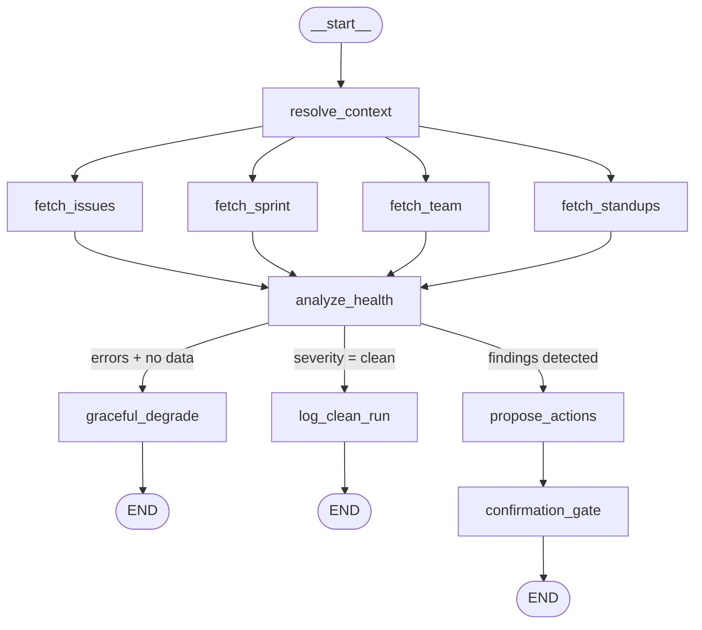
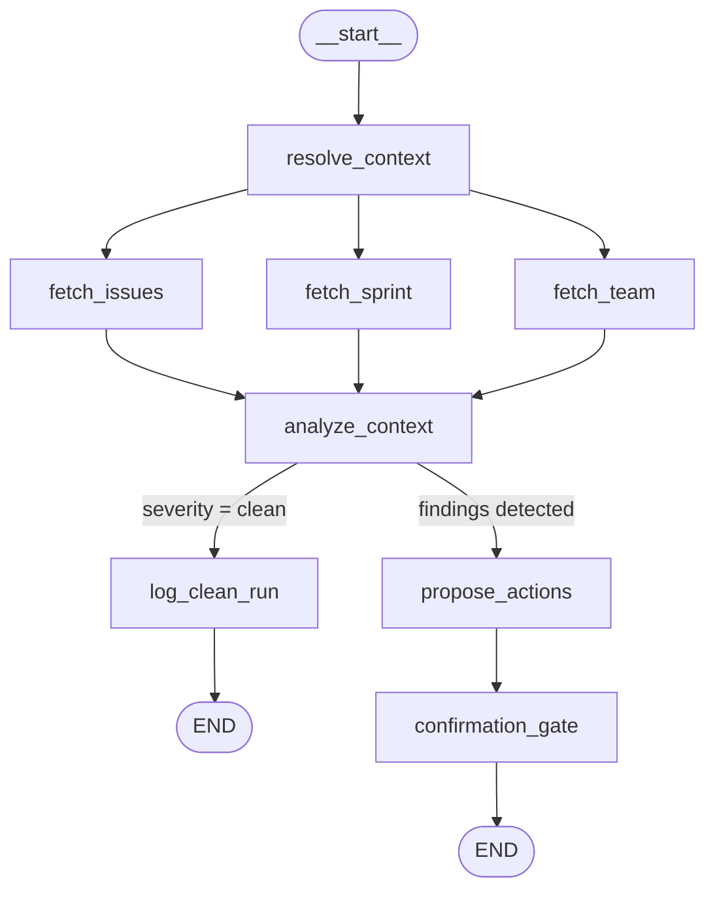

---
stepsCompleted:
  - step-01-init
  - step-02-context
  - step-03-system-architecture
  - step-04-data-architecture
  - step-05-integration
  - step-06-deployment
  - step-07-observability
  - step-08-security
  - step-09-cost
  - step-10-complete
inputDocuments:
  - _bmad-output/planning-artifacts/prd.md
  - _bmad-output/planning-artifacts/ux-design-specification.md
  - gauntlet_docs/PRESEARCH.md
  - gauntlet_docs/FleetGraph_PRD.md
  - gauntlet_docs/mvp-project-plan.md
  - gauntlet_docs/technical-research-langgraph-claude-sdk.md
  - docs/application-architecture.md
  - docs/unified-document-model.md
workflowType: 'architecture'
project_name: FleetGraph
user_name: Diane
date: '2026-03-17'
---

# Architecture Decision Document — FleetGraph

**Author:** Diane
**Date:** 2026-03-17

---

## 1. Project Context & Architectural Drivers

### What FleetGraph Is

FleetGraph is an autonomous AI reasoning agent that extends Ship — a US Treasury internal project management platform — by continuously monitoring project data and surfacing quality gaps before evaluators discover them. It operates in two modes: **proactive** (cron-polled health checks) and **on-demand** (context-scoped chat from Ship's UI).

### Architectural Drivers

| Driver | Constraint | Impact |
|--------|-----------|--------|
| **Brownfield integration** | Must extend Ship without modifying its core API or database schema | FleetGraph is a separate service consuming Ship's REST API |
| **30-hour MVP sprint** | Solo developer, fixed deadline | Architecture optimizes for time-to-working over theoretical elegance |
| **LangGraph.js requirement** | Assignment mandates graph-based agent with LangSmith tracing | Framework choice is prescribed; architecture decisions center on node design and state management |
| **Real data only** | No mocks in production — all findings from live Ship data | Service authentication and API resilience are first-order concerns |
| **< 5 min detection latency** | Proactive findings must surface within 5 minutes of triggering event | Drives polling interval and graph execution time budget |
| **Government platform context** | Ship is US Treasury internal; no external data egress beyond LLM API calls | Security boundaries and data minimization in traces |

### Brownfield Reality

Ship's existing architecture (from `docs/application-architecture.md`) provides:
- **REST API** at `/api/*` endpoints for issues, sprints, team, standups
- **API token system** (`ship_<64 hex>`, Bearer auth, CSRF-exempt) — ideal for service-to-service auth
- **Unified document model** — everything is a document with `document_type` and JSONB `properties`
- **WebSocket** for real-time collaboration (Yjs CRDT sync) — not useful for FleetGraph's polling model
- **Session-based auth** with 15-minute timeout — FleetGraph uses API tokens to avoid session management

FleetGraph adds no tables, no migrations, and no modifications to Ship's codebase. It is a pure consumer of existing API endpoints.

---

## 2. System Architecture

### High-Level Architecture

```
┌──────────────────────────────────────────────────────────────────────┐
│                           Railway Project                            │
│                                                                      │
│  ┌─────────────────────┐      ┌──────────────────────────────────┐  │
│  │   Ship API (nginx   │      │       FleetGraph Service         │  │
│  │   + Express + WS)   │◄────►│    (Express + LangGraph.js)      │  │
│  │                     │ REST │                                    │  │
│  │  /api/issues        │      │  ┌────────────────────────────┐  │  │
│  │  /api/weeks         │      │  │  Proactive Graph (cron)    │  │  │
│  │  /api/team/grid     │      │  │  On-Demand Graph (HTTP)    │  │  │
│  │  /api/standups      │      │  │  Confirmation Gate (HITL)  │  │  │
│  │                     │      │  └────────────────────────────┘  │  │
│  └─────────────────────┘      └──────────────┬───────────────────┘  │
│                                               │                      │
└───────────────────────────────────────────────┼──────────────────────┘
                                                │
                                    ┌───────────┴────────────┐
                                    │                        │
                              ┌─────▼──────┐          ┌──────▼──────┐
                              │ Claude API │          │  LangSmith  │
                              │ (Anthropic │          │  (tracing)  │
                              │  Sonnet)   │          │             │
                              └────────────┘          └─────────────┘
```

### Decision: Separate Service (Not Embedded in Ship API)

**Chosen:** FleetGraph runs as its own Railway service, separate from Ship's Express server.

**Why:**
- Proactive polling (every 3 minutes) should not compete with Ship's request handling — a long-running LLM call during a cron cycle could degrade Ship's API latency
- Independent deploy cycle — iterate on the agent without redeploying Ship
- Cleaner LangSmith traces — agent runs are isolated from Ship's request noise
- Failure isolation — if FleetGraph crashes or the Claude API is down, Ship is unaffected

**Tradeoff:** An additional Railway service to manage and monitor. Acceptable given Railway's built-in health checks and auto-restart.

### Decision: Combined Worker + API in One Process

**Chosen:** Single Node.js process runs both the cron-based proactive polling and the Express endpoints for on-demand chat and human-in-the-loop resume.

**Why:**
- Simplest deployment model — one Procfile entry, one health check
- Both modes share the same compiled graphs and Ship API client
- For MVP traffic (one user, < 10 on-demand queries/day), a single process handles everything easily
- Splitting into worker + API service would double Railway costs with no benefit at current scale

**When to revisit:** If on-demand chat latency degrades because a proactive cron run is consuming CPU/memory at the same time. At that point, split into two Railway services sharing the same codebase.

---

## 3. Graph Architecture

### Two Graphs, Shared Nodes

FleetGraph uses two compiled LangGraph.js `StateGraph` instances that share the same node functions but wire different topologies:

| Graph | Trigger | Fetch Nodes | Reasoning Node | Purpose |
|-------|---------|-------------|----------------|---------|
| **Proactive** | 3-minute cron | `fetch_issues`, `fetch_sprint`, `fetch_team`, `fetch_standups` (parallel) | `analyze_health` | Autonomous health monitoring |
| **On-Demand** | HTTP POST to `/api/fleetgraph/chat` | `fetch_issues`, `fetch_sprint`, `fetch_team` (parallel) | `analyze_context` | User-initiated, document-scoped analysis |

Both graphs share: `resolve_context`, `propose_actions`, `confirmation_gate`, `log_clean_run`, `graceful_degrade`.

### Proactive Graph Topology



**Key conditional edge:** After `analyze_health`, the graph routes to one of three paths based on state:
1. **Errors + no data** → `graceful_degrade` → END (API failure case)
2. **Severity = clean** → `log_clean_run` → END (healthy project)
3. **Findings detected** → `propose_actions` → `confirmation_gate` → END (problems found)

This produces visibly different LangSmith traces for each condition — a graded deliverable requirement.

### On-Demand Graph Topology



**Difference from proactive:** No `fetch_standups` (not relevant to on-demand queries), uses `analyze_context` (receives user's question + document context) instead of `analyze_health`.

### Decision: Two Separate Compiled Graphs (Not One Graph with Mode Branching)

**Chosen:** Two separate `StateGraph` builds compiled independently with their own `MemorySaver` checkpointers.

**Why:**
- Each graph has a different set of fetch nodes (proactive has standups, on-demand doesn't)
- Different reasoning nodes with different prompts and analysis goals
- Cleaner LangSmith traces — "proactive run" and "on-demand query" are visually distinct graph shapes
- Simpler conditional edge logic — no mode-checking at every branch point

**Tradeoff:** Some node definitions are shared via imports (good — DRY), but the graph wiring is duplicated (acceptable — only ~20 lines each, and they genuinely differ).

---

## 4. Node Design Decisions

### Context Node (`resolve_context`)

**Responsibility:** Pass through trigger type, workspace ID, and document context from initial state. Currently a thin passthrough that logs the run configuration.

**Future growth:** Will resolve the invoking user's role and workspace membership when the evaluator aggregation view (Phase 4) requires role-based filtering.

### Fetch Nodes (`fetch_issues`, `fetch_sprint`, `fetch_team`, `fetch_standups`)

**Pattern:** Each fetch node:
1. Calls Ship API via `shipApi` wrapper (which uses `fetchWithRetry` with exponential backoff)
2. Returns fetched data on success, empty data + error string on failure
3. Never throws — errors are accumulated in the `errors` state array

**Parallel execution:** LangGraph runs all fetch nodes concurrently because `resolve_context` has edges to all of them simultaneously. Total fetch time = slowest single API call (~1-2 seconds), not sum of all calls.

**Decision: Error accumulation, not failure propagation.** If `fetch_team` fails but `fetch_issues` succeeds, the reasoning node still runs with available data. This is the right choice for a monitoring agent — partial data is better than no data.

### Reasoning Nodes (`analyze_health`, `analyze_context`)

**Model:** Claude Sonnet 4.6 (`claude-sonnet-4-6`) via `@langchain/anthropic` ChatAnthropic.

**Structured output:** Both reasoning nodes use `model.withStructuredOutput()` with a Zod schema to produce typed `Finding[]` arrays. This eliminates parsing ambiguity — Claude returns validated JSON matching the schema, or the call fails.

**Token budget management:**
- Active issues are filtered (exclude `done`/`cancelled`) and capped at 100 (proactive) or 50 (on-demand)
- Only essential fields are sent: `id`, `title`, `status`, `assignee_id`, `priority`, `updated_at`, `created_at`
- Full document content is never sent to the reasoning node

**Decision: Named tool use for structured output.** The `withStructuredOutput` call binds the Zod schema as a named tool (`project_health_analysis` / `context_analysis`). This is more reliable than asking Claude to produce JSON in its response text — the tool use mechanism guarantees schema conformance.

### Action Nodes (`propose_actions`, `confirmation_gate`, `log_clean_run`, `graceful_degrade`)

**`propose_actions`:** Maps each finding to a `ProposedAction` with `requiresConfirmation: true`. Currently all actions require confirmation — the agent never writes to Ship autonomously.

**`confirmation_gate`:** Uses LangGraph's `interrupt()` to pause graph execution and return the proposed actions to the caller. The graph state is checkpointed via `MemorySaver`, and execution resumes when the caller invokes `Command({ resume: { decision } })` via the `/api/fleetgraph/resume` endpoint.

**`graceful_degrade`:** Returns empty findings with `severity: "clean"` when all data fetches failed. Prevents the agent from producing hallucinated findings based on no data.

---

## 5. State Management

### Graph State Schema

The `FleetGraphState` annotation defines all data flowing through the graph:

| Field | Type | Reducer | Purpose |
|-------|------|---------|---------|
| `messages` | `BaseMessage[]` | Append (inherited from `MessagesAnnotation`) | Chat history for on-demand mode |
| `triggerType` | `"proactive" \| "on-demand"` | Replace | Which mode initiated this run |
| `documentId` | `string \| null` | Replace | Current document context (on-demand) |
| `documentType` | `string \| null` | Replace | Document type (issue, sprint, etc.) |
| `workspaceId` | `string` | Replace | Target workspace |
| `userId` | `string \| null` | Replace | Invoking user (on-demand) |
| `issues` | `Record<string, unknown>[]` | Replace | Fetched issue data |
| `sprintData` | `Record<string, unknown> \| null` | Replace | Active sprint data |
| `teamGrid` | `Record<string, unknown> \| null` | Replace | Team allocation data |
| `standupStatus` | `Record<string, unknown> \| null` | Replace | Standup completion data |
| `findings` | `Finding[]` | Replace | Reasoning output |
| `severity` | `"clean" \| "info" \| "warning" \| "critical"` | Replace | Aggregate severity |
| `proposedActions` | `ProposedAction[]` | Replace | Actions awaiting confirmation |
| `errors` | `string[]` | **Accumulate** (spread) | Error log across all nodes |

**Key design choice:** The `errors` array uses an accumulating reducer (`(prev, next) => [...prev, ...next]`) while all other fields use replacement reducers (`(_, next) => next`). This means errors from parallel fetch nodes are collected, not overwritten — essential for understanding partial failures.

### Decision: MemorySaver Checkpointer (MVP)

**Chosen:** `MemorySaver` (in-memory) for both graphs.

**Why:** Zero-config, sufficient for MVP where the only user of interrupt/resume is the `/api/fleetgraph/resume` endpoint during the same process lifetime.

**Limitation:** State is lost on process restart. A proactive run that hits the `confirmation_gate` will lose its checkpoint if Railway restarts the service before the user responds.

**Upgrade path:** Replace with `@langchain/langgraph-checkpoint-postgres` when:
- Finding persistence is implemented (Phase 4)
- Multiple users are interacting with confirmation gates concurrently
- Railway deploys cause checkpoint loss that affects user experience

---

## 6. Ship API Integration

### Authentication

**Mechanism:** Bearer token via Ship's API token system.

```
Authorization: Bearer ship_<64 hex characters>
```

**Why not session cookies:** Ship's session auth has a 15-minute idle timeout. A cron-based service polling every 3 minutes would need to re-authenticate constantly. API tokens are long-lived, CSRF-exempt, and designed for programmatic access.

**Token provisioning:** Generated via Ship's `POST /api/api-tokens` endpoint (requires a one-time session login). Stored as `FLEETGRAPH_API_TOKEN` environment variable on Railway.

### API Endpoints Consumed

| Ship Endpoint | FleetGraph Node | Data Purpose |
|--------------|-----------------|--------------|
| `GET /api/issues` | `fetch_issues` | All issues for health analysis |
| `GET /api/issues?document_type=sprint&status=active` | `fetch_sprint` | Active sprint data |
| `GET /api/team/grid` | `fetch_team` | Team allocation and workload |
| `GET /api/standups/status` | `fetch_standups` | Standup completion status |
| `GET /api/documents/:id` | `shipApi.getDocument` | Single document detail (on-demand) |
| `GET /api/documents/:id/associations` | `shipApi.getDocumentAssociations` | Document relationships (on-demand) |
| `GET /api/issues/:id/history` | `shipApi.getIssueHistory` | Change timeline (on-demand) |

### Resilience Pattern

All API calls go through `fetchWithRetry`:
1. **Timeout:** 10 seconds per request (`AbortSignal.timeout`)
2. **Retries:** 2 retries with exponential backoff (1s, 2s delays)
3. **LangSmith tracing:** Wrapped with `traceable()` for observability — every API call appears in the trace
4. **Graceful failure:** Each fetch node catches errors and returns empty data + error string, never throws

**Decision: Retry at the fetch level, degrade at the graph level.** Individual API calls retry transparently. If they still fail, the graph continues with partial data. If all fetches fail, the conditional edge routes to `graceful_degrade`.

---

## 7. FleetGraph API Design

FleetGraph exposes three HTTP endpoints:

| Method | Path | Purpose | Request Body |
|--------|------|---------|-------------|
| `GET` | `/health` | Health check (Railway monitors this) | — |
| `POST` | `/api/fleetgraph/chat` | On-demand analysis from Ship UI | `{ documentId, documentType, message, threadId, workspaceId }` |
| `POST` | `/api/fleetgraph/resume` | Resume after human-in-the-loop | `{ threadId, decision }` |
| `POST` | `/api/fleetgraph/analyze` | Manual trigger for proactive analysis | `{ workspaceId }` |

### Decision: No Authentication on FleetGraph Endpoints (MVP)

**Current state:** FleetGraph's endpoints are unauthenticated. Any caller can invoke `/api/fleetgraph/chat`.

**Why acceptable for MVP:** FleetGraph is deployed on Railway's internal network. In production, Ship's backend will proxy requests to FleetGraph (session-authenticated user → Ship backend → FleetGraph), so authentication happens at the Ship layer.

**Post-MVP:** Add a shared secret or mTLS between Ship and FleetGraph to prevent unauthorized direct access.

---

## 8. Ship UI Integration Architecture (Post-MVP)

The UX design specification defines two UI surfaces that will integrate with FleetGraph:

### Findings Panel (Proactive Mode)

**Integration point:** New icon rail mode in Ship's 4-panel layout.

```
Ship's 4-Panel Layout:
┌──────┬────────────────┬──────────────────────────┬────────────────┐
│ Icon │  Contextual    │     Main Content         │  Properties    │
│ Rail │  Sidebar       │     (Editor)             │  Sidebar       │
│ 48px │  224px         │     flex-1               │  256px         │
│      │                │                          │                │
│  📊  │ [FleetGraph    │                          │                │
│  ──  │  Findings]     │                          │                │
│  🔔 ←│  • 3 critical  │                          │                │
│  (3) │  • 2 warning   │                          │                │
│      │  • 1 info      │                          │                │
└──────┴────────────────┴──────────────────────────┴────────────────┘
```

**Data flow:**
1. Ship frontend polls `GET /api/fleetgraph/findings` (new endpoint to add) or FleetGraph pushes via WebSocket
2. React Query cache with 3-minute `refetchInterval` matching the cron cycle
3. FindingCard components in the contextual sidebar using existing Radix + Tailwind patterns
4. Badge count on icon rail updates from React Query cache

### Chat Drawer (On-Demand Mode)

**Integration point:** Floating overlay drawer, bottom-right, over main content.

**Data flow:**
1. User clicks "Ask FleetGraph" button (visible when viewing an issue or sprint)
2. Ship frontend sends `POST /api/fleetgraph/chat` with `documentId`, `documentType`, user's message
3. Response rendered in the chat drawer as structured analysis (headings, bullet points, metrics)
4. Chat is stateless per session — no persistent conversation history in MVP

### Decision: Ship Backend Proxies to FleetGraph (Not Direct Browser → FleetGraph)

**Chosen:** Ship's Express backend proxies FleetGraph API calls, adding session authentication and token translation.

```
Browser → Ship API (session auth) → FleetGraph Service (Bearer token)
```

**Why:**
- Ship handles session validation and user identification
- FleetGraph doesn't need to implement Ship's auth protocol
- CORS is avoided — same-origin requests to Ship API
- Ship can enrich requests with workspace context before forwarding

---

## 9. Observability Architecture

### LangSmith Tracing (Primary)

**Configuration:** Two environment variables enable full auto-tracing:
```
LANGSMITH_TRACING=true
LANGSMITH_API_KEY=lsv2_...
```

**What's traced automatically:**
- Full graph execution (entry → each node → edges → exit)
- LLM calls within reasoning nodes (input/output tokens, latency, model)
- Conditional edge decisions (which branch was taken)
- Interrupt/resume cycles
- Custom API calls (via `traceable()` wrapper on `fetchWithRetry`)

**Trace differentiation:** The three conditional branches after `analyze_health` produce visibly different execution paths in LangSmith — satisfying the graded requirement for 2+ distinct trace shapes.

### Application Logging (Console)

All nodes log to stdout with bracketed prefixes: `[resolve_context]`, `[fetch_issues]`, `[analyze_health]`, etc. Railway captures stdout automatically.

**Log levels:**
- `console.log` — normal operation (node start, fetch counts, finding counts)
- `console.error` — failures (API errors, LLM errors)

### Health Endpoint

`GET /health` returns:
```json
{
  "status": "ok",
  "service": "fleetgraph",
  "tracing": true,
  "uptime": 3600
}
```

Railway monitors this endpoint for auto-restart decisions.

### Decision: No Custom Metrics or Alerting (MVP)

**Why:** LangSmith traces provide per-run cost, latency, and token usage. Console logs on Railway provide operational visibility. Custom CloudWatch metrics or PagerDuty alerts are overkill for a single-user MVP.

**Post-MVP:** Add LangSmith alerts for runs exceeding $0.10 (as identified in the Diane operator journey).

---

## 10. Cost Architecture

### Per-Run Cost Model

| Component | Tokens | Cost |
|-----------|--------|------|
| Reasoning input (filtered issues + sprint + team data) | ~2,000 | ~$0.006 |
| Reasoning output (structured findings + summary) | ~2,000 | ~$0.030 |
| **Total per proactive run** | **~4,000** | **~$0.036** |

**Model:** Claude Sonnet 4.6 at $3/MTok input, $15/MTok output.

### Token Budget Controls

1. **Issue filtering:** Only non-done/non-cancelled issues sent to reasoning node
2. **Issue cap:** Maximum 100 issues (proactive) / 50 issues (on-demand)
3. **Field selection:** Only `id`, `title`, `status`, `assignee_id`, `priority`, `updated_at`, `created_at` — no content blobs
4. **Max output tokens:** 4,096 per reasoning call

### Scaling Projections

| Scale | Proactive runs/day | Daily cost | Monthly cost |
|-------|-------------------|------------|--------------|
| MVP (1 user) | ~480 (3-min interval) | ~$17 | ~$520 |
| 100 users (~20 active projects) | ~9,600 | ~$346 | ~$10,500 |
| With rule-based pre-filtering (70% skip LLM) | ~2,880 actual LLM runs | ~$104 | ~$3,150 |

### Decision: No Rule-Based Pre-Filtering (MVP)

**Current:** Every cron cycle invokes the full graph including LLM reasoning.

**Why acceptable for MVP:** Single project, ~$17/day, well within budget.

**Optimization path:** Add a lightweight change-detection check before the reasoning node. If no issues have `updated_at` newer than the last poll, skip the LLM call entirely. This would reduce costs by 70-80% at scale.

---

## 11. Deployment Architecture

### Railway Configuration

| Setting | Value |
|---------|-------|
| **Service type** | Web |
| **Build command** | `cd fleetgraph && npm run build` |
| **Start command** | `cd fleetgraph && node dist/index.js` |
| **Health check** | `GET /health` |
| **Port** | `3001` (via `PORT` env var) |

### Environment Variables

| Variable | Purpose | Required |
|----------|---------|----------|
| `ANTHROPIC_API_KEY` | Claude API access | Yes |
| `LANGSMITH_TRACING` | Enable LangSmith tracing | Yes (`true`) |
| `LANGSMITH_API_KEY` | LangSmith authentication | Yes |
| `FLEETGRAPH_API_TOKEN` | Ship API Bearer token | Yes |
| `SHIP_API_URL` | Ship API base URL | Yes |
| `PORT` | Express listen port | No (default: 3001) |
| `LANGCHAIN_CALLBACKS_BACKGROUND` | Async trace flushing | Recommended (`true`) |

### Decision: `fleetgraph/` as a Standalone Package (Not pnpm Workspace Member)

**Chosen:** `fleetgraph/` lives at the repo root as an independent Node.js package with its own `package.json`, `tsconfig.json`, and `node_modules/`.

**Why:**
- Ship uses `pnpm` workspaces for `api/`, `web/`, `shared/`. FleetGraph has zero shared dependencies with Ship (no `shared/` types, no `pg`, no TipTap).
- Independent `npm install` and `tsc` build — no interference with Ship's build pipeline
- Separate Railway service deploys only the `fleetgraph/` directory
- Can be extracted to its own repository if the scope grows beyond Ship

**Tradeoff:** No shared TypeScript types between Ship and FleetGraph. Currently acceptable because FleetGraph consumes Ship's REST API (JSON), not Ship's TypeScript interfaces. If Ship UI integration happens (Phase 4), shared types for Finding/ProposedAction would be useful — add a `fleetgraph-shared/` package at that point.

---

## 12. Security Considerations

### Data Flow Boundaries

```
┌──────────────────────────────────────────────────────────┐
│                    Trust Boundary                          │
│                                                            │
│  Ship API ──(REST/JSON)──► FleetGraph ──(HTTPS)──► Claude │
│           Bearer token                  API key             │
│                                                            │
│  FleetGraph ──(HTTPS)──► LangSmith                        │
│              API key                                       │
└──────────────────────────────────────────────────────────┘
```

### Data Minimization

- **Sent to Claude:** Filtered issue metadata (IDs, titles, statuses, timestamps). Never: document content, user credentials, full API responses.
- **Sent to LangSmith:** Execution metadata (node names, durations, token counts). Finding summaries appear in traces but not raw Ship data dumps.
- **Never logged:** API tokens, user credentials, full response bodies.

### Secret Management

All secrets are Railway environment variables — never committed to source code. The `FLEETGRAPH_API_TOKEN` is generated via Ship's token system (SHA-256 hashed at rest in Ship's database, plaintext only shown once on creation).

### Decision: Read-Only Agent (MVP and Permanent)

FleetGraph **never** writes to Ship's database or API. All proposed actions are surfaced to the user via the confirmation gate. Even after confirmation, the user performs the action in Ship's UI — FleetGraph does not execute write operations on their behalf.

**Why:** Government platform context demands conservative automation. Read-only eliminates the risk of the agent making unauthorized changes to project state. This is a permanent architectural constraint, not an MVP shortcut.

---

## 13. Technology Decisions Summary

| Decision | Choice | Alternatives Considered | Rationale |
|----------|--------|------------------------|-----------|
| **Graph framework** | LangGraph.js 1.2.2 | Custom graph, Python LangGraph | Assignment requirement; auto LangSmith tracing; TypeScript matches Ship |
| **LLM** | Claude Sonnet 4.6 | Haiku (cheaper), Opus (smarter) | Best cost/capability ratio; ~$0.036/run |
| **Structured output** | Zod schema + `withStructuredOutput` | JSON parsing from text, function calling | Guaranteed schema conformance; typed findings |
| **Runtime** | Node.js + TypeScript | Python | Same language as Ship; shares no code but shares developer context |
| **Scheduler** | `node-cron` | `setInterval`, external cron, webhooks | Lightweight, declarative, no external dependency |
| **HTTP framework** | Express 4 | Fastify, Hono | Matches Ship's stack; "boring technology" principle |
| **Checkpointer** | MemorySaver (in-memory) | PostgreSQL, Redis | Zero-config for MVP; upgrade path documented |
| **Deployment** | Railway (single service) | AWS Lambda, Docker on EB | Existing infra; easy env vars; built-in health checks |
| **Ship API auth** | Bearer API token | Session cookies, OAuth | Long-lived, no timeout management, designed for services |
| **Tracing** | LangSmith (auto via env vars) | OpenTelemetry, custom logging | Zero-config with LangGraph; traces are graded artifacts |

---

## 14. Phased Evolution Roadmap

### Current State (MVP — Implemented)

- Proactive graph with 4 parallel fetch nodes + Claude reasoning + confirmation gate
- On-demand graph with context-scoped analysis
- 3-minute cron polling
- MemorySaver checkpointing
- Railway deployment with health endpoint
- LangSmith tracing on all runs

### Phase 2 — Early Submission (Targeted)

- Error/fallback node improvements (better degraded-mode messaging)
- Second distinct LangSmith trace link captured (on-demand vs. proactive)
- Architecture decisions documented (this document)
- Test cases with trace links

### Phase 3 — Final Submission

- Cost analysis (development spend + production projections)
- Edge case testing against real data
- Stable deployment verified

### Phase 4 — Vision (Post-Program)

| Capability | Architecture Impact |
|-----------|-------------------|
| Ship UI integration (findings panel + chat drawer) | Add Ship API proxy routes; React components in `web/` |
| Finding persistence | Replace MemorySaver with PostgreSQL checkpointer; add findings table to Ship schema |
| Evaluator cross-project dashboard | Add aggregation endpoints; role-based finding filtering |
| Rule-based pre-filtering | Add change-detection node before reasoning; skip LLM when no changes detected |
| Webhook triggers (replacing polling) | Build webhook dispatch into Ship API; eliminate cron dependency |
| Cache layer | Add Redis on Railway for dismissed findings, polling timestamps, API response cache |
| Additional proactive detections | Add new reasoning prompts; extend issue cap and token budget |

---

## 15. Architectural Risks & Mitigations

| Risk | Likelihood | Impact | Mitigation |
|------|-----------|--------|------------|
| **Claude API outage** | Medium | High — all reasoning stops | `graceful_degrade` node prevents crashes; findings paused, not lost |
| **Ship API rate limiting** | Low (single consumer) | Medium — partial data | `fetchWithRetry` with backoff; parallel fetches reduce total calls |
| **LLM hallucinated findings** | Medium | High — false positives erode trust | Structured output schema constrains output; evidence-linked findings allow verification; dismiss is one click |
| **MemorySaver checkpoint loss** | High (any restart) | Low for MVP | Upgrade to PostgreSQL checkpointer when persistence matters |
| **Token cost drift** | Medium (as projects grow) | Medium — $17/day → $50+/day | Issue cap at 100; field filtering; future: rule-based pre-filter |
| **Session token expiry** | Low (using API tokens) | High — all fetches fail | API tokens don't use session mechanism; if token revoked, operator generates new one |

---

*This document captures the architectural decisions made during FleetGraph's development. It is a living document — update as decisions evolve.*
