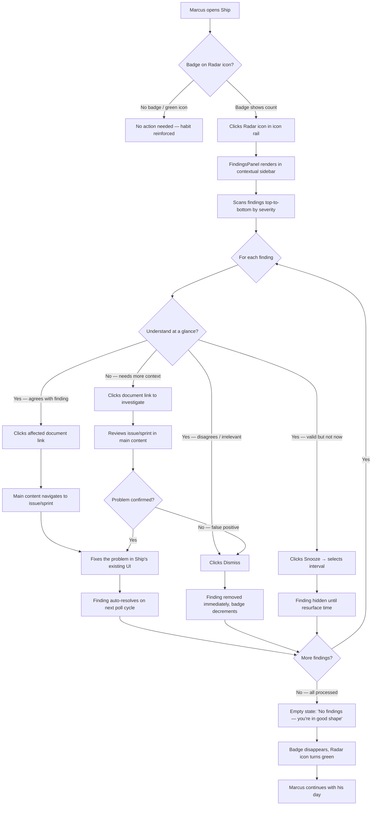
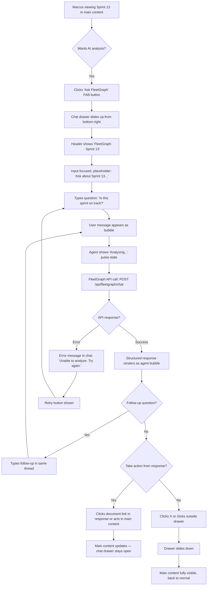
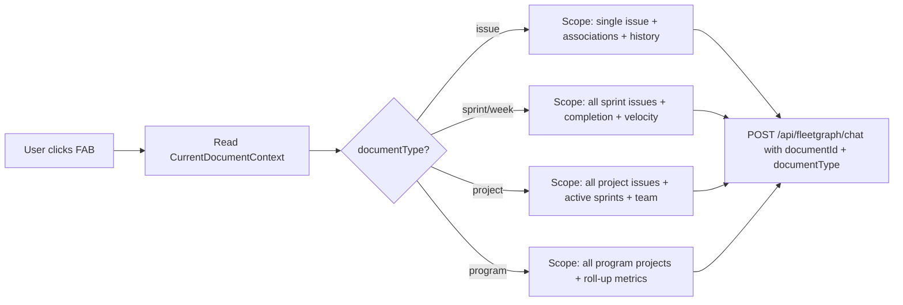

---
stepsCompleted:
  - step-01-init
  - step-02-discovery
  - step-03-core-experience
  - step-04-emotional-response
  - step-05-inspiration
  - step-06-design-system
  - step-07-defining-experience
  - step-08-visual-foundation
  - step-09-design-directions
  - step-10-user-journeys
  - step-11-component-strategy
  - step-12-ux-patterns
  - step-13-responsive-accessibility
  - step-14-complete
lastStep: 14
inputDocuments:
  - _bmad-output/planning-artifacts/prd.md
  - gauntlet_docs/FleetGraph_PRD.md
  - gauntlet_docs/PRESEARCH.md
  - gauntlet_docs/mvp-project-plan.md
  - gauntlet_docs/technical-research-langgraph-claude-sdk.md
---

# UX Design Specification — FleetGraph

**Author:** Diane
**Date:** 2026-03-16

---

## Executive Summary

### Project Vision

FleetGraph is an autonomous AI reasoning agent that extends Ship — a US Treasury internal project management platform — by continuously monitoring project data and surfacing quality gaps, process violations, and risks before evaluators discover them. The agent operates in two modes: proactive (pushing findings on a scheduled polling cycle) and on-demand (responding to user-initiated, context-scoped queries from within Ship's UI). The backend pipeline (LangGraph.js, Claude Sonnet reasoning, parallel Ship API fetches, human-in-the-loop gates) is already built and deployed on Railway. The UX design challenge is injecting FleetGraph's intelligence into Ship's existing brownfield interface so it feels native, not bolted on.

The meta-goal is behavioral change: when engineers know an AI agent is watching for unassigned issues, empty sprints, and process gaps, they self-correct. FleetGraph doesn't fix mistakes — it makes them visible.

### Target Users

| User Archetype | Role | Primary Need | Interaction Pattern |
|----------------|------|-------------|---------------------|
| **Marcus** (Software Engineer) | Day-to-day IC in Gauntlet program | Morning notification of mistakes; quick sprint health checks; one-click fixes | Passive (reads findings) + Active (asks chat questions) |
| **Dr. Patel** (Evaluator) | Assesses 8+ projects with limited time | Aggregated cross-project findings, severity sorting, timestamped evidence | Read-only consumption (deferred to post-MVP) |
| **Diane** (Operator/Admin) | Deployed and maintains FleetGraph | Health monitoring, cost tracking, trace review | Already served by Railway + LangSmith — no Ship UI needed for MVP |

**User characteristics:** Technically sophisticated software engineers in a training program. They value power features over hand-holding, work on desktop browsers during business hours, and primarily engage during morning standup prep and end-of-day review.

### Key Design Challenges

1. **Brownfield integration without disruption.** Ship has a tight 4-panel layout (48px icon rail, 224px contextual sidebar, flex-1 main content, 256px properties sidebar). FleetGraph's UI surfaces must work within this existing spatial model — using the same icon rail modes, contextual sidebar patterns, Radix components, and Tailwind dark theme — without introducing a fifth panel or breaking the established interaction grammar.

2. **Two interaction models in one agent.** Proactive findings (pushed, passive consumption — a notification inbox) and on-demand chat (pulled, active conversation — a contextual assistant) are fundamentally different UX patterns that must feel like the same coherent agent. Users need clear mental models for when to check findings vs. when to ask a question.

3. **Human-in-the-loop that doesn't feel like friction.** The confirm/dismiss gate is critical for trust and safety (the agent never writes to Ship without approval), but if every finding requires explicit action, it becomes a chore. The UX must make acting on findings faster than ignoring them — one-click confirm, batch dismiss, smart defaults.

### Design Opportunities

1. **The "morning briefing" habit loop.** A badge count on the icon rail creates a habit-forming hook — Marcus opens Ship, sees "3 new findings," and makes the findings panel his first stop every morning. This positions FleetGraph as a personalized quality checkpoint, not just another notification system.

2. **Chat as power feature, not chatbot.** By scoping chat to the exact document the user is viewing (issue, sprint), FleetGraph sidesteps the "generic AI assistant" trap. "Ask FleetGraph about this sprint" is a tool with a specific job, which builds more trust with technical users than an open-ended conversational interface.

3. **Progressive trust building.** The UX can support a trust progression: v1 shows read-only informational findings with document links (proving accuracy); v2 introduces confirm-to-act buttons (once users trust the agent's judgment). This mirrors how the agent itself is designed — it proposes, the human decides.

## Core User Experience

### Defining Experience

FleetGraph's core experience is the **findings-first interaction loop**: the agent monitors project state across five proactive use cases (stale issues, sprint health, missing standups, triage aging, workload imbalance), surfaces structured findings in a persistent panel, and enables one-click navigation to the affected document for resolution. The secondary experience is **context-scoped chat** for two on-demand use cases (sprint summary, issue context) where the agent reasons about whatever the user is currently viewing.

The seven required use cases from PRESEARCH define the interaction surface:

| # | Use Case | Mode | Trigger | UI Surface |
|---|----------|------|---------|------------|
| 1 | Stale Issue Detection | Proactive (2-3 min poll) | Issues stuck >3 days | Findings Panel |
| 2 | Sprint Health Monitor | Proactive (2-3 min poll) | Completion trending below target | Findings Panel |
| 3 | Missing Standup Alerts | Proactive (daily check) | No standup by threshold time | Findings Panel |
| 4 | Triage Queue Aging | Proactive (5 min poll) | Issues in triage >24h | Findings Panel |
| 5 | Workload Imbalance | Proactive (weekly) | Capacity >150% or <25% | Findings Panel |
| 6 | On-Demand Sprint Summary | On-demand | User opens chat on sprint view | Chat Drawer |
| 7 | On-Demand Issue Context | On-demand | User opens chat on issue view | Chat Drawer |

### Platform Strategy

- **Platform:** Desktop web browser only (Ship is a government internal web application)
- **Input method:** Mouse/keyboard — no touch considerations
- **Brownfield constraint:** All UI surfaces must integrate into Ship's existing 4-panel layout (48px icon rail, 224px contextual sidebar, flex-1 main content, 256px properties sidebar) using the existing component library (Radix UI, Tailwind dark theme, TanStack React Query)
- **No offline requirement:** FleetGraph requires live Ship API access and Claude API access; offline mode is not applicable
- **Integration approach:** New icon rail mode + contextual sidebar for findings; floating chat drawer for on-demand; API proxy through Ship backend for auth translation (session cookies to bearer token)

### Effortless Interactions

1. **Finding comprehension in one glance.** Each finding card tells the full story without drilling down: severity badge, title, one-line evidence summary, affected document link, and suggested action. No expanding, no "see more," no second click to understand what's wrong.

2. **Chat knows what you're looking at.** On-demand chat (use cases 6-7) reads `CurrentDocumentContext` automatically. Opening chat on a sprint view means FleetGraph already has the sprint ID, all its issues, and their states. The user's first message is their question, never "I'm looking at sprint 12."

3. **Finding-to-fix in two clicks.** Click the affected document link in a finding card → land on that issue/sprint in the main content area → make the fix (assign, reprioritize, update). The findings panel stays accessible in the sidebar so Marcus can return and work through the next finding.

4. **Badge count as ambient awareness.** The icon rail badge shows unresolved finding count. No notification popups, no interruptions — just a number that updates. Marcus checks it when he's ready, not when the agent decides.

### Critical Success Moments

1. **"The morning glance."** Marcus opens Ship, sees "5" on the FleetGraph badge, clicks it, scans five findings sorted by severity, and fixes three of them in under two minutes. This is the moment FleetGraph proves its value — it found things he would have missed, and fixing them was trivial.

2. **"The sprint sanity check."** Marcus feels uneasy about a sprint. He opens chat, types "Is this sprint on track?", and gets a structured response: 4 issues unstarted, 2 unassigned, completion rate below historical average, and two blockers identified. The moment he gets specific, evidence-backed analysis scoped to exactly what he's looking at — that's when chat feels like a power feature.

3. **"The evaluator's shortcut."** (Post-MVP) Dr. Patel opens the FleetGraph dashboard, sees aggregated findings across all 8 projects, and completes her evaluation in half the time. Timestamped, evidence-linked findings replace subjective impressions.

4. **"The self-correction."** Over weeks, Marcus's critical finding count drops. He's checking his work more carefully because he knows FleetGraph is watching. This is the meta-success moment — the agent changed behavior, not just surfaced information.

### Experience Principles

1. **Findings first, chat second.** Five of seven use cases flow through the findings panel. It is the primary interaction surface and must be the most polished. Chat is powerful but secondary.

2. **Native, not novel.** Every FleetGraph UI surface uses Ship's existing patterns — icon rail mode, contextual sidebar, Radix components, Tailwind classes, dark theme. If a user can't tell where Ship ends and FleetGraph begins, we've succeeded.

3. **Act faster than ignore.** Confirming or fixing a finding must require fewer interactions than dismissing or snoozing it. The path of least resistance should be the productive path.

4. **Context is automatic.** The agent always knows what the user is looking at (document ID, type, sprint, project). Users never provide context the system already has.

5. **Transparent reasoning.** Every finding includes evidence (specific issue IDs, timestamps, data points). Every chat response cites the data it reasoned about. The agent earns trust by showing its work, not by being confidently vague.

## Desired Emotional Response

### Primary Emotional Goals

FleetGraph should make users feel **confident and in control** — like they have a co-pilot watching their blind spots. The dominant emotion is empowerment ("I can fix this before anyone notices"), not anxiety ("what did I screw up?"). The agent's tone is competent and matter-of-fact: it surfaces problems the way a good colleague would — clearly, without drama, with a suggested next step.

The secondary emotional goal is **respect for the tool**. When Marcus tells a teammate about FleetGraph, the feeling behind it is: "This thing caught three issues I would have completely missed before my eval." That's relief mixed with professional respect — the agent earned its place in his workflow.

### Emotional Journey Mapping

| Stage | Desired Feeling | Design Implication | Anti-Pattern to Avoid |
|-------|----------------|-------------------|----------------------|
| **First discovery** (sees badge) | Curiosity — "what did it find?" | Badge count is informational, not alarming. No red alerts, no urgency theming for info/warning severity. | Dread — "what did I screw up?" |
| **Scanning findings** | In control — "I can handle all of these" | Findings sorted by severity, scannable in <10 seconds. Card design emphasizes clarity over density. | Overwhelmed — "too many things wrong" |
| **Fixing an issue** | Satisfaction — "that was easy" | One click from finding to affected document. Fix is in Ship's existing UI, not a new workflow. | Friction — "this is more work than just checking myself" |
| **After clearing findings** | Accomplished — "clean slate, good to go" | Empty state shows a positive message: "No findings — you're in good shape." Not a blank panel. | Emptiness — "now what?" |
| **Returning next day** | Habitual — "let me check my FleetGraph" | Badge count updates on page load. Findings panel remembers scroll position. Consistent location in icon rail. | Forgettable — "oh right, that thing exists" |
| **Using chat on-demand** | Empowered — "I have a power tool" | Chat responds with structured analysis, not conversational filler. Data-rich, concise, specific to context. | Skeptical — "is this actually useful?" |
| **False positive encountered** | Unbothered — "easy dismiss, no big deal" | Dismiss is one click, no confirmation dialog. Dismissed findings don't resurface. Trust recovery is cheap. | Betrayed — "I can't trust this anymore" |

### Micro-Emotions

The three critical micro-emotion axes for FleetGraph:

1. **Confidence over confusion.** Every finding must be instantly comprehensible — severity, what's wrong, where, and what to do. If Marcus has to re-read a finding to understand it, the emotional contract is broken. Design implication: no jargon in findings, no ambiguous severity, no "see more" to understand the problem.

2. **Trust over skepticism.** Each finding links to evidence (specific issue IDs, timestamps, data points). The agent shows its work. If Marcus clicks through and the issue is exactly as described, trust compounds. If a finding is wrong, the one-click dismiss makes recovery painless. Design implication: evidence is visible on the card, not hidden behind a drill-down.

3. **Accomplishment over frustration.** The time to fix should always be shorter than the time the agent saved by finding it. If FleetGraph surfaces "3 unassigned issues" and Marcus can assign all three in under a minute, the emotional math works — the agent saved him from an evaluator catch that would have cost far more. Design implication: finding-to-fix is two clicks max; findings panel stays open while working in the main content area.

### Design Implications

| Emotional Goal | UX Design Choice |
|---------------|-----------------|
| Curiosity, not dread | Badge uses neutral color (not red) for info/warning. Red reserved only for critical severity. |
| In control, not overwhelmed | Maximum ~10 findings visible at once. Group by severity with collapsible sections if count exceeds threshold. |
| Satisfaction on fix | After navigating to affected document, finding card shows subtle "viewing" indicator. When issue is resolved, finding auto-resolves on next poll. |
| Accomplished on clear | Empty state is a positive, branded moment — not a blank panel. Reinforces the habit loop. |
| Habitual return | Badge count is always visible in icon rail. No action required to see if there are new findings — ambient awareness. |
| Empowered by chat | Chat responses are structured (headings, bullet points, metrics), not conversational paragraphs. Data density signals competence. |
| Unbothered by false positives | Dismiss is one click, no "are you sure?" dialog. Snooze offers presets (1h, 4h, tomorrow), not a date picker. |

### Emotional Design Principles

1. **Calm authority.** FleetGraph communicates like a senior engineer doing a code review — direct, specific, no sugar-coating, but never aggressive. Finding language uses factual statements ("Issue #42 has had no updates for 4 days") not judgments ("You forgot to update issue #42").

2. **Low-cost trust recovery.** False positives are inevitable with AI reasoning. The UX must make dismissing a wrong finding effortless — one click, no penalty, no "why are you dismissing this?" friction. Trust is rebuilt by the next accurate finding, not by making dismissal hard.

3. **Ambient over interruptive.** FleetGraph never pops up, never blocks, never demands attention. It updates a badge count. It waits in the sidebar. It answers when asked. The user is always in control of when they engage with the agent.

4. **Evidence as emotional anchor.** When a user feels uncertain about a finding ("is this really a problem?"), the linked evidence resolves that uncertainty immediately. Evidence isn't just for accuracy — it's for emotional confidence. Every finding must pass the "click-through test": if Marcus clicks the affected document link, does he immediately see the problem the agent described?

## UX Pattern Analysis & Inspiration

### Inspiring Products Analysis

**GitHub Security Alerts / Dependabot (Primary inspiration for proactive findings)**

GitHub's security alert system is the closest analogue to FleetGraph's proactive findings model, and the target users — software engineers — already have this pattern in their muscle memory. Dependabot monitors dependencies, surfaces vulnerabilities as a badge count on the repository's Security tab, presents them as a severity-sorted list, links each alert to the affected file, and offers dismiss or auto-fix actions. When the underlying vulnerability is resolved (PR merged), the alert auto-disappears.

What makes it work:
- **Ambient badge count** on a persistent tab — no popups, no interruptions
- **Severity-sorted list** with color-coded badges (critical/high/moderate/low)
- **Evidence-linked cards** — each alert shows the specific dependency, version, and CVE
- **One-click navigation** to the affected file/dependency
- **Auto-resolve** — fix the problem and the alert disappears on next scan
- **Batch operations** — dismiss multiple alerts at once
- **Informational tone** — alerts feel factual, not alarming

**Notion AI (Primary mental model for on-demand chat)**

Notion's AI is invoked from within the document the user is editing — not in a separate chatbot interface. The AI knows the page context automatically. Users think of it as "use AI on this page" rather than "open the AI assistant." This mental model maps directly to FleetGraph's on-demand mode: the chat knows what sprint or issue the user is viewing because it reads the document context, not because the user tells it.

What makes it work:
- **Context-scoped invocation** — AI operates on what you're looking at, not in a vacuum
- **Feels like a page feature** — not a separate product bolted on
- **Structured output** — results are formatted for the document context, not conversational prose
- **Minimal ceremony** — invoke, get result, continue working

**Intercom/Zendesk Chat Widget (UI mechanics for on-demand chat)**

The floating chat widget pattern provides the UI mechanics for FleetGraph's on-demand chat: a small trigger button in the bottom-right corner that expands to an overlay panel. The user's current view (the sprint, the issue) remains visible behind the chat, preserving spatial context. The drawer is temporary — open it, ask a question, get an answer, close it.

What makes it work:
- **Floating trigger button** — always available, never in the way
- **Overlay drawer** — doesn't replace or push aside existing content
- **Preserves spatial context** — the document/sprint/issue stays visible
- **Dismissible** — close it and you're right back where you were

### Transferable UX Patterns

| Pattern | Source | FleetGraph Application |
|---------|--------|----------------------|
| **Ambient badge count** | GitHub Security tab | Icon rail FleetGraph mode shows unresolved finding count; updates on poll cycle |
| **Severity-sorted card list** | GitHub Dependabot alerts | Findings panel in contextual sidebar; cards sorted critical → warning → info |
| **Evidence-linked navigation** | GitHub alert → affected file | Finding card → click affected document link → land on issue/sprint in main content |
| **Auto-resolve on fix** | Dependabot alert disappears when PR merged | Finding disappears from panel when next poll detects the condition is resolved |
| **Batch dismiss** | GitHub bulk alert dismissal | Select multiple findings → dismiss all; for clearing false positives quickly |
| **Context-scoped AI invocation** | Notion AI on current page | Chat reads `CurrentDocumentContext` (documentId, documentType) automatically |
| **Floating overlay drawer** | Intercom chat widget | "Ask FleetGraph" button in bottom-right → slide-up chat panel over main content |
| **Structured AI responses** | Notion AI output formatting | Chat responses use headings, bullet points, metrics — not conversational paragraphs |

### Anti-Patterns to Avoid

1. **The standalone chatbot page.** A dedicated `/fleetgraph/chat` route with no document context violates the assignment requirement ("embedded in context, not a standalone chatbot") and strips the agent of its key advantage — knowing what the user is looking at. Avoid at all costs.

2. **Toast notification spam.** Proactive findings should NOT trigger toast notifications, browser notifications, or any interruptive alert. The badge count is sufficient. Notification spam turns a useful agent into an annoyance and conflicts with the "ambient over interruptive" emotional principle.

3. **Modal confirmation dialogs.** The human-in-the-loop gate should NOT use modal dialogs ("Are you sure you want to confirm this action?"). Modals break flow and add friction to the productive path. Confirm/dismiss should be inline button clicks on the finding card itself.

4. **Conversational AI filler.** Chat responses should NOT start with "Great question!" or "I'd be happy to help!" Engineers find this patronizing. FleetGraph should respond like a senior engineer — lead with the data, skip the pleasantries.

5. **Findings that require expansion to understand.** If a finding card shows only a title and requires clicking "expand" or "see details" to understand the problem, the card has failed. The one-glance comprehension principle means the card itself must tell the full story.

6. **Persistent chat history as primary interface.** FleetGraph's on-demand chat is a *tool invocation*, not an ongoing conversation. Long chat histories with scrollback create the wrong mental model. Each chat session is scoped to the current document context; previous sessions are not prominently displayed.

### Design Inspiration Strategy

**Adopt directly:**
- GitHub's badge count + severity-sorted list pattern for the findings panel — this is proven, familiar to the target audience, and maps 1:1 to FleetGraph's proactive use cases
- Intercom's floating button + overlay drawer for the chat UI mechanics — solves the spatial constraint without adding a fifth panel to Ship's layout

**Adapt for FleetGraph:**
- Notion AI's context-scoping, but with *structured findings output* instead of free-form text generation — FleetGraph's chat returns analysis with metrics and evidence, not document content
- GitHub's auto-resolve behavior, adapted to poll-based detection — findings resolve when the next proactive scan no longer detects the condition, with a brief "resolved" state before removal

**Avoid:**
- Linear's triage queue metaphor — implies incoming work assignment ("someone sent this to you") rather than agent-surfaced intelligence ("the system noticed something")
- Slack-style notification channels — creates a separate destination users must check rather than integrating into the existing Ship workflow
- Dashboard-first design — FleetGraph is a sidebar tool, not a page; the main content area belongs to Ship's documents

## Design System Foundation

### Design System Choice

**Extend Ship's existing Radix UI + Tailwind CSS system. No new libraries.**

FleetGraph is a brownfield integration — Ship already has a mature, consistent design system. Introducing a new component library or design framework would create visual inconsistency and increase bundle size. Instead, all FleetGraph components are built using the same primitives and patterns as the rest of Ship.

### Rationale for Selection

1. **Visual consistency is non-negotiable.** The "native, not novel" experience principle requires FleetGraph to be indistinguishable from Ship's existing UI. Using the same Radix primitives and Tailwind tokens guarantees this.

2. **Zero additional bundle cost.** Radix UI, Tailwind CSS, Lucide icons, and TanStack React Query are already installed and tree-shaken. FleetGraph components add only their own code — no new library overhead.

3. **Familiar patterns for Ship contributors.** Any developer who has worked on Ship's existing components can build and maintain FleetGraph components without learning a new framework.

4. **Government compliance inherited.** Ship's USWDS color accents and accessibility patterns (ARIA labels, focus management, semantic HTML) carry forward to FleetGraph components automatically.

### Implementation Approach

**Existing Ship design system inventory:**

| Layer | Technology | FleetGraph Usage |
|-------|-----------|-----------------|
| **Component primitives** | Radix UI (Dialog, Popover, Tooltip, ScrollArea) | Chat drawer via Radix Popover or custom overlay; tooltips on finding cards |
| **Styling** | Tailwind CSS + custom dark theme | All FleetGraph components use Ship's existing color tokens and spacing scale |
| **Color tokens** | `bg-[#0d0d0d]` (background), `text-[#f5f5f5]` (foreground), `#005ea2` (USWDS accent) | Finding severity badges add semantic colors within this palette |
| **Server state** | TanStack React Query | FleetGraph API calls (findings poll, chat messages) use React Query with appropriate cache/refetch intervals |
| **Icons** | Lucide React | FleetGraph icon rail item + finding severity icons + chat UI icons |
| **Existing patterns** | PropertyRow, Combobox, FilterTabs, BulkActionBar | Finding cards follow the same spacing/typography as issue list items |

**New components required (built with existing primitives):**

| Component | Ship Precedent | Implementation Notes |
|-----------|---------------|---------------------|
| **FindingCard** | Issue list item in `SelectableList` | Same card structure (icon + text + actions), add severity badge and document link |
| **FindingsPanel** | `IssuesSidebar` / `DocumentsTree` | Contextual sidebar content for FleetGraph mode, same 224px width, same scroll behavior |
| **ChatDrawer** | No direct precedent (new pattern) | Floating overlay panel, positioned bottom-right, uses Tailwind for layout + Radix ScrollArea for message list |
| **ChatInput** | `StandupFeed` text input | Simplified single-line input with send button, not full TipTap editor |
| **BadgeCount** | Standup-due dot indicator on icon rail | Extend existing badge pattern to show numeric count |
| **EmptyState** | Existing empty states in list views | Positive message + icon when no findings present |

### Customization Strategy

**Severity color system (extending Ship's palette):**

| Severity | Badge Color | Rationale |
|----------|------------|-----------|
| Critical | `text-red-400 bg-red-400/10` | Red reserved exclusively for critical — aligns with "curiosity not dread" principle |
| Warning | `text-amber-400 bg-amber-400/10` | Amber for attention-worthy but not urgent — familiar from GitHub/CI patterns |
| Info | `text-blue-400 bg-blue-400/10` | Blue (Ship's USWDS accent) for informational — lowest visual weight |

**Component spacing:** All FleetGraph components use Ship's existing Tailwind spacing scale (`p-2`, `p-3`, `gap-2`, etc.) and font sizes (`text-sm`, `text-xs`). No custom spacing tokens.

**Dark theme only:** Ship is a dark-themed application. FleetGraph components are designed for dark mode exclusively — no light mode variant needed.

**Animation:** Minimal. Chat drawer uses a simple slide-up transition (`transition-transform duration-200`). Finding card actions use Tailwind's built-in hover/focus states. No spring animations, no complex transitions — matches Ship's understated aesthetic.

## Defining Experience

### The One-Sentence Experience

**"It's like Dependabot but for project management — it catches stuff you missed."**

FleetGraph's defining experience is the **morning glance loop**: see a badge count → open the findings panel → scan severity-sorted cards → click through to the affected document → fix the problem → return for the next finding. This loop should take under two minutes for a typical set of 3-5 findings. If we nail this interaction, the chat, the evaluator dashboard, and every future feature builds on proven value.

### User Mental Model

**Current mental model (without FleetGraph): Reactive discovery.**
Marcus doesn't systematically check for unassigned issues, stale work, or empty sprints. He finds problems when an evaluator flags them, when a teammate mentions them, or when he stumbles on them while doing something else. Quality gaps persist because nobody is watching for them.

**Target mental model (with FleetGraph): Ambient monitoring.**
Something is watching for Marcus while he codes. When he opens Ship, a badge count tells him if there's anything to deal with. He processes findings the same way he processes Dependabot alerts — scan, assess, fix or dismiss, move on. He doesn't need to remember to check; the system remembers for him.

**Why Dependabot is the right metaphor:**
- Engineers already have Dependabot in their muscle memory — the interaction pattern is learned
- It sets the right expectation: automated, ambient, finding-level granularity, not a conversation
- It implies trust through accuracy — Dependabot alerts are almost always real; FleetGraph aspires to the same
- It implies the correct response: process findings, don't have a conversation about them
- It doesn't imply intelligence beyond detection — no expectation that FleetGraph will fix things for you

**Mental model boundaries:**
- FleetGraph is NOT a chatbot (even though it has chat) — it's a monitoring agent with a chat feature
- FleetGraph is NOT a dashboard — it doesn't show status, it shows *problems*
- FleetGraph is NOT a notification system — it doesn't interrupt, it waits to be checked

### Success Criteria

The defining experience succeeds when:

1. **Badge-to-done < 2 minutes.** Marcus sees the badge, opens findings, processes 3-5 findings (fix or dismiss), and returns to his work in under two minutes. If this takes longer, the findings are too complex or the navigation is too slow.

2. **Zero "what does this mean?" moments.** Every finding card is self-explanatory on first read. Marcus never has to click into a finding to understand what it's about. Severity + title + one-line description + affected document link tells the complete story.

3. **Fix rate > dismiss rate.** If users are dismissing more findings than fixing them, the agent is producing too many false positives or low-value findings. The UX should track this ratio (in analytics, not shown to users).

4. **Return rate is daily.** Marcus checks FleetGraph findings every morning as part of his routine. The badge count creates the habit; the fast processing time sustains it. If users stop checking, the habit loop is broken.

5. **Chat invocation feels like a power move.** When Marcus opens the on-demand chat on a sprint, he feels like he's using an advanced tool — not falling back to a chatbot. The structured, data-rich response confirms this feeling.

### Novel UX Patterns

**Pattern mix: Established mechanics, novel application.**

FleetGraph uses entirely familiar UI patterns — badge counts, card lists, floating chat drawers, severity badges — but applies them to a novel context: an autonomous AI agent monitoring project management data. The novelty is in *what the agent detects*, not in *how the user interacts with it*.

| Pattern | Type | User Education Needed |
|---------|------|----------------------|
| Badge count on icon rail | Established (GitHub, Slack, email) | None — universally understood |
| Severity-sorted card list | Established (GitHub alerts, error logs) | None — engineers read these daily |
| Click-through to affected document | Established (any linked alert system) | None — standard navigation |
| Confirm/dismiss inline buttons | Established (notification inbox, triage queue) | Minimal — "confirm" means "do the suggested action" |
| Floating chat drawer | Established (Intercom, Zendesk, Notion AI) | Minimal — familiar widget pattern |
| Context-scoped chat | Novel application of established pattern | Low — Notion AI has normalized "AI that knows what page you're on" |
| Auto-resolving findings | Semi-novel (Dependabot does this, but for code) | None — findings just disappear when fixed, which feels natural |

**No new interaction paradigms to teach.** The riskiest UX element is the human-in-the-loop "confirm" button — users need to understand that confirming a finding means the agent will execute the suggested Ship action (e.g., reassign an issue). This is mitigated by clear button labeling and the fact that, in MVP, confirm actions are limited to navigation (not write operations).

### Experience Mechanics

**Primary Loop: Morning Glance (Proactive Findings)**

| Step | User Action | System Response | Feedback |
|------|------------|-----------------|----------|
| **1. Initiation** | Marcus opens Ship, sees badge count "5" on FleetGraph icon | Badge count updated on page load via polling FleetGraph API | Number is visible without clicking — ambient awareness |
| **2. Open panel** | Clicks FleetGraph icon in icon rail | Contextual sidebar (224px) renders FindingsPanel with 5 cards sorted by severity | Panel slides in using same animation as other sidebar modes |
| **3. Scan** | Eyes move top-to-bottom through finding cards | Cards display: severity badge → title → one-line description → affected doc link | Critical findings (if any) are at top with red badge; most findings are warning (amber) or info (blue) |
| **4. Act on finding** | Clicks affected document link on first finding card | Main content area navigates to that issue/sprint; findings panel stays visible in sidebar | Finding card shows subtle "viewing" indicator |
| **5. Fix** | Makes the fix in Ship's existing UI (e.g., assigns the issue) | Ship saves the change normally | Standard Ship save feedback |
| **6. Return** | Eyes return to findings panel in sidebar | Finding remains until next poll cycle detects resolution, then auto-resolves | Finding card fades out or shows "resolved" briefly |
| **7. Repeat or dismiss** | Clicks next finding, or dismisses irrelevant ones | Dismiss removes finding immediately (one click, no confirmation dialog) | Badge count decrements |
| **8. Completion** | All findings processed | Empty state: "No findings — you're in good shape." with a subtle positive icon | Badge disappears from icon rail |

**Secondary Loop: Sprint Sanity Check (On-Demand Chat)**

| Step | User Action | System Response | Feedback |
|------|------------|-----------------|----------|
| **1. Initiation** | Marcus is viewing a sprint in main content area, clicks "Ask FleetGraph" button (bottom-right) | Chat drawer slides up (300-400px wide, 50% viewport height), overlay position | Drawer shows sprint context automatically: "Analyzing Sprint 12..." |
| **2. Ask** | Types question: "Is this sprint on track?" | Message appears in chat as user bubble; loading indicator shows agent is reasoning | Typing indicator or "Analyzing..." state |
| **3. Response** | Reads agent response | Structured response: summary paragraph, key metrics (completion %, days remaining, unstarted count), specific risks identified, suggested actions | Response uses headings, bullets, bold metrics — not conversational prose |
| **4. Follow-up (optional)** | Asks follow-up: "Which issues are blocking?" | New response scoped to same sprint context | Same structured format |
| **5. Completion** | Closes chat drawer (X button or click outside) | Drawer slides down, main content fully visible again | No persistent state — next chat invocation starts fresh for new context |

## Visual Design Foundation

### Color System

**Inherited from Ship (no changes):**

| Token | Value | Usage |
|-------|-------|-------|
| Background | `#0d0d0d` | Page background, sidebar, panels |
| Surface | `#171717` | Card backgrounds, elevated surfaces |
| Border | `#262626` | Card borders, dividers, panel edges |
| Foreground | `#f5f5f5` | Primary text |
| Muted | `#a3a3a3` | Secondary text, descriptions, timestamps |
| Accent | `#005ea2` | Links, active states, selected icon rail items (USWDS blue) |

**New FleetGraph semantic colors (severity system):**

| Severity | Text | Background | Badge | Rationale |
|----------|------|-----------|-------|-----------|
| Critical | `text-red-400` | `bg-red-400/10` | Solid `bg-red-500` | Red reserved exclusively for critical — only severity that demands immediate attention |
| Warning | `text-amber-400` | `bg-amber-400/10` | Solid `bg-amber-500` | Amber for noteworthy but not urgent — familiar from CI/GitHub patterns |
| Info | `text-blue-400` | `bg-blue-400/10` | Solid `bg-blue-500` | Blue (matching USWDS accent) for informational — lowest visual weight |
| Resolved | `text-emerald-400` | `bg-emerald-400/10` | — | Brief "resolved" state before finding fades from panel |

**Chat-specific colors:**

| Element | Style | Rationale |
|---------|-------|-----------|
| User message bubble | `bg-[#005ea2]/20` (accent tint) | Subtle differentiation from agent messages; aligns with Ship's accent |
| Agent message bubble | `bg-[#171717]` (surface) | Neutral, content-focused — agent messages are the primary content |
| Agent "analyzing" state | `text-[#a3a3a3]` with animated pulse | Subtle loading indicator, not a spinner — matches calm authority tone |

### Typography System

**Fully inherited from Ship — no new fonts or scales:**

| Element | Style | FleetGraph Usage |
|---------|-------|-----------------|
| Finding card title | `text-sm font-medium` (14px) | Same as issue list item titles |
| Finding description | `text-xs text-[#a3a3a3]` (12px) | Same as property labels |
| Severity badge label | `text-xs font-semibold uppercase` | "CRITICAL", "WARNING", "INFO" |
| Chat user message | `text-sm` (14px) | Standard body text |
| Chat agent response | `text-sm` (14px) with `font-medium` for headings | Structured output with visual hierarchy |
| Chat agent metrics | `text-sm font-mono` | Numbers and percentages stand out via monospace |
| Badge count | `text-xs font-bold` (12px) | Small, readable on icon rail |
| Empty state message | `text-sm text-[#a3a3a3]` | Soft, unobtrusive |

### Spacing & Layout Foundation

**FleetGraph operates within Ship's existing layout grid:**

```
┌──────────┬────────────────┬─────────────────────────┬──────────────┐
│ Icon Rail│ Findings Panel │     Main Content        │  Properties  │
│  48px    │    224px       │      flex-1             │    256px     │
│          │ (contextual    │                         │  (existing   │
│  [Radar] │  sidebar)      │   ┌─────────────────┐   │   sidebar)   │
│  icon +  │                │   │                 │   │              │
│  badge   │ FindingCard    │   │  Document /     │   │              │
│          │ FindingCard    │   │  Issue / Sprint  │   │              │
│          │ FindingCard    │   │  (Ship content)  │   │              │
│          │ ...            │   │                 │   │              │
│          │                │   │                 │   │              │
│          │                │   │    ┌──────────┐ │   │              │
│          │                │   │    │ Chat     │ │   │              │
│          │                │   │    │ Drawer   │ │   │              │
│          │                │   │    │ (overlay)│ │   │              │
│          │                │   │    └──────────┘ │   │              │
│          │                │   └─────────────────┘   │              │
└──────────┴────────────────┴─────────────────────────┴──────────────┘
```

**Component spacing (all using Tailwind's existing scale):**

| Component | Padding | Gap | Rationale |
|-----------|---------|-----|-----------|
| Finding card | `p-3` (12px) | `gap-2` (8px) between elements | Matches density of Ship's issue list items |
| Finding card stack | — | `gap-1` (4px) between cards | Tight stack for scannability; borders provide separation |
| Findings panel header | `px-3 py-2` | — | Matches other sidebar mode headers |
| Chat drawer | `p-4` (16px) | `gap-3` (12px) between messages | Slightly more breathing room — chat is a focused interaction |
| Chat input area | `p-3` (12px) | — | Comfortable typing area without feeling oversized |
| Badge count overlay | `px-1.5 py-0.5` (6px/2px) | — | Tight, pill-shaped — sits on top-right corner of Radar icon |

**Chat drawer dimensions:**

| Property | Value | Rationale |
|----------|-------|-----------|
| Width | `w-[360px]` | Wide enough for structured responses; doesn't obscure too much content |
| Max height | `max-h-[50vh]` | Half viewport — preserves document context above |
| Position | `fixed bottom-4 right-4` | Bottom-right corner, floating over main content |
| Border radius | `rounded-lg` (8px) | Matches Ship's card styling |
| Shadow | `shadow-xl` | Elevated — clearly an overlay, not part of the layout |
| Z-index | `z-50` | Above all content but below modals |

### Accessibility Considerations

**Inherited from Ship's existing compliance:**
- Skip-to-main-content link already present in App.tsx
- Semantic HTML (`<nav>`, `<main>`, `<aside>`) already in use
- Focus management via `useFocusOnNavigate` hook
- WCAG 2.1 AA color contrast already enforced

**FleetGraph-specific accessibility requirements:**

| Requirement | Implementation |
|-------------|---------------|
| Severity colors must not be the only indicator | Each severity has both color AND text label ("CRITICAL", "WARNING", "INFO") |
| Finding cards must be keyboard-navigable | Tab through cards, Enter to navigate to affected document, Escape to dismiss |
| Chat drawer must trap focus when open | Focus stays within drawer; Tab cycles through input and close button; Escape closes |
| Badge count must be announced | `aria-label="5 FleetGraph findings"` on the icon rail button |
| Chat loading state must be announced | `aria-live="polite"` region for "Analyzing..." and response arrival |
| Dismiss/confirm actions must have clear labels | `aria-label="Dismiss finding: 3 unassigned issues"` — not just "Dismiss" |

### FleetGraph Icon

**Icon:** Lucide `Radar`
**Rationale:** The radar sweep communicates "something is actively scanning your project" — the core Dependabot mental model. It's distinctive (not used elsewhere in Ship's icon rail), immediately recognizable, and doesn't imply "chatbot" or "AI assistant."

**Badge count overlay:** When findings exist, a small pill badge appears on the top-right of the Radar icon showing the count. Styling: `bg-amber-500 text-white text-xs font-bold rounded-full min-w-[18px] h-[18px]`. Amber by default (most findings are warnings); switches to `bg-red-500` if any critical findings are present.

## Design Direction Decision

### Design Directions Explored

Six finding panel variations and two supplementary mockups were created and evaluated against FleetGraph's experience principles (see `_bmad-output/planning-artifacts/ux-design-directions.html` for interactive mockups):

| Direction | Approach | Verdict |
|-----------|----------|---------|
| **A: Full Cards** | Severity + title + description + link + inline actions per card | **Selected** — maximum one-glance comprehension |
| B: Compact | Severity + title only, no description | Rejected — violates one-glance comprehension; "Fix" button too vague |
| C: Grouped | Collapsible severity sections | Deferred — good scaling strategy for 10+ findings, but overhead for typical 3-5 finding count |
| D: Hover Actions | Full cards, actions appear on hover only | Runner-up — cleaner default state, but hidden actions conflict with "act faster than ignore" and have accessibility concerns |
| E: Sidebar Chat | Chat as second tab in FleetGraph sidebar | Rejected — 224px too narrow for chat; can't see findings and chat simultaneously; doesn't meet "embedded in context" requirement |
| F: Notification Dots | Colored dots + titles only, macOS-style | Rejected — no evidence, no inline actions, conflicts with multiple experience principles |

**Supplementary mockups validated:**
- **Chat Drawer** — floating overlay on document views with structured responses. Confirmed as the on-demand interaction surface.
- **Empty State** — green ShieldCheck icon + "No findings — you're in good shape" + "Next scan in 2 minutes." Green Radar icon in rail (no badge) signals all-clear.

### Chosen Direction

**Direction A: Full Finding Cards** with floating Chat Drawer for on-demand mode.

Each finding card contains all information needed for a decision without any interaction:
- Severity badge (color-coded: critical/warning/info + text label)
- Title (concise problem statement)
- One-line description (evidence summary with specific IDs and data)
- Affected document link (clickable, navigates to issue/sprint in main content)
- Inline action buttons: context-specific confirm action (e.g., "Self-assign", "Populate sprint") + Dismiss + Snooze

Cards are sorted by severity (critical first, then warning, then info), then by recency within each severity level.

The "viewing" state (blue left border) connects the sidebar finding to the document currently shown in the main content area, creating a visual thread between the finding and the thing it's about.

### Design Rationale

1. **One-glance comprehension wins.** Direction A is the only approach where Marcus can understand a finding, its evidence, and what to do about it without clicking, expanding, or hovering. This directly serves the "badge-to-done < 2 minutes" success criteria.

2. **Inline actions serve "act faster than ignore."** Confirm/dismiss buttons are always visible on every card. Marcus doesn't need to discover them or navigate elsewhere to take action. The productive path (confirm) is visually prominent; the dismissive path is muted.

3. **Evidence on the card builds trust.** The description line shows specific issue IDs, timestamps, and data points. Marcus can verify the finding's accuracy at a glance before clicking through. This serves the "evidence as emotional anchor" principle.

4. **4-5 cards visible is sufficient.** With a typical finding count of 3-5 per scan, Direction A shows all findings without scrolling. For the rare 10+ finding scenario, severity-sorted scrolling is natural. Direction C's grouped approach could be adopted as a future enhancement if finding counts consistently exceed 8.

5. **Floating chat drawer preserves document context.** The chat overlay lets Marcus see the sprint/issue he's asking about while reading FleetGraph's response. Direction E's sidebar tab would hide findings when chatting and is too narrow for structured responses.

### Implementation Approach

**Finding Card Component (`FindingCard.tsx`):**
```
┌─────────────────────────────────────┐
│ [SEVERITY]                          │
│ Title of the finding                │
│ One-line description with evidence  │
│ ↗ Affected document link            │
│ [Confirm action] [Dismiss] [Snooze] │
└─────────────────────────────────────┘
```

**Findings Panel Component (`FindingsPanel.tsx`):**
- Renders as contextual sidebar content when FleetGraph mode is active in icon rail
- Header: "FleetGraph Findings" + active count
- Body: scrollable list of FindingCard components
- Empty state: ShieldCheck icon + positive message + next scan countdown
- Data: React Query polling FleetGraph API every 30 seconds for latest findings

**Chat Drawer Component (`ChatDrawer.tsx`):**
- Floating overlay: `fixed bottom-4 right-4 w-[360px] max-h-[50vh] z-50`
- Header: Radar icon + "FleetGraph · {documentTitle}" + close button
- Messages: user bubbles (accent tint) + agent bubbles (surface color) with structured formatting
- Input: single-line text input + Send button
- Trigger: "Ask FleetGraph" FAB button (visible only on document views)
- Context: reads `CurrentDocumentContext` for automatic document scoping

**Icon Rail Integration:**
- New Radar icon added to icon rail in `App.tsx`
- BadgeCount overlay: amber pill (default) or red pill (if critical findings exist)
- Green Radar icon (no badge) when all findings resolved
- Click activates FleetGraph mode → FindingsPanel renders in contextual sidebar

## User Journey Flows

### Journey 1: Morning Glance — Proactive Findings

**User:** Marcus (Software Engineer)
**Trigger:** Opens Ship at start of day
**Use cases served:** 1 (Stale Issues), 2 (Sprint Health), 3 (Missing Standups), 4 (Triage Aging), 5 (Workload Imbalance)



**Step-by-step interaction detail:**

| Step | Duration | User Action | System Response | Screen State |
|------|----------|------------|-----------------|-------------|
| 1 | 0s | Opens Ship | Page loads, FleetGraph polls API | Badge "5" visible on Radar icon |
| 2 | 1s | Clicks Radar icon | Sidebar mode switches to FleetGraph | FindingsPanel with 5 cards, sorted by severity |
| 3 | 3-5s | Scans card titles and severity | — | Eyes move top-to-bottom |
| 4 | 2s | Clicks document link on critical finding | Main content navigates to Sprint 14 | Sprint view loads; finding card shows "viewing" state |
| 5 | 10-15s | Adds issues to Sprint 14 in Ship's UI | Ship saves changes | Sprint now has issues assigned |
| 6 | 1s | Eyes return to sidebar | Finding remains (resolves on next poll) | Sidebar still visible alongside main content |
| 7 | 1s | Clicks Dismiss on an info finding | Card removed, badge shows "4" | One fewer card in sidebar |
| 8 | 30-60s | Repeats for remaining findings | Each action updates badge count | Cards disappear as processed |
| 9 | — | All findings processed | Empty state renders | Green Radar icon, "No findings" message |

**Total journey time: ~90 seconds for 5 findings.** Within the "badge-to-done < 2 minutes" success criteria.

**Error recovery paths:**
- If document link leads to a deleted/archived issue → main content shows Ship's standard "not found" state; finding should include enough context to understand without clicking
- If FleetGraph API is unreachable → FindingsPanel shows "Unable to reach FleetGraph. Retrying..." with last-known findings grayed out
- If findings are stale (FleetGraph service down) → header shows "Last scan: 15 minutes ago" warning

### Journey 2: Sprint Sanity Check — On-Demand Chat

**User:** Marcus (Software Engineer)
**Trigger:** Viewing a sprint or issue and wants AI analysis
**Use cases served:** 6 (Sprint Summary), 7 (Issue Context)



**Chat context resolution flow:**



**Interaction detail:**

| Step | Duration | User Action | System Response |
|------|----------|------------|-----------------|
| 1 | 0s | Viewing sprint in main content | FAB button visible in bottom-right |
| 2 | 0.5s | Clicks FAB | Drawer slides up (200ms transition) |
| 3 | 2-5s | Types question | — |
| 4 | 0.5s | Presses Enter or clicks Send | Message bubble appears, "Analyzing..." state |
| 5 | 3-8s | Waits for response | FleetGraph reasons over sprint data |
| 6 | 5-15s | Reads structured response | Metrics, risks, and recommendations displayed |
| 7 | varies | Optional follow-up or close | Thread continues or drawer dismisses |

**Total journey time: ~15-30 seconds** from question to structured answer. Within the PRD's "on-demand response < 15 seconds" requirement.

**Response format specification:**

Agent responses must use structured formatting, not conversational prose:

```
Sprint 13 Analysis                    ← h5 heading, muted color
━━━━━━━━━━━━━━━━━━━━━━━━━━━━━━━━━━━
Completion: 42% with 2 days remaining ← key metric in monospace amber

Risks identified:
• 4 issues unstarted                  ← bullet list
• 3 issues unassigned
• Below historical velocity by 35%    ← metric in monospace amber

Recommended actions:                  ← bold heading
• Re-scope sprint to critical items only
• Assign AUTH-042 and AUTH-045 immediately
• Flag blocker dependency to team
```

### Journey 3: Human-in-the-Loop Confirmation

**User:** Marcus (Software Engineer)
**Trigger:** FleetGraph proposes a write action that requires human approval
**Requirement:** FR14-FR16 (human-in-the-loop gates)

```mermaid
flowchart TD
    A[Finding card shows proposed action] --> B{User reviews finding}
    B --> C{Action appropriate?}
    C -->|Yes| D[Clicks confirm button e.g. 'Self-assign all']
    D --> E[Button shows loading state]
    E --> F[POST /api/fleetgraph/resume with confirmation]
    F --> G{API response?}
    G -->|Success| H[Finding card transitions to 'resolved' state]
    H --> I[Emerald badge: 'Done' — fades after 3 seconds]
    I --> J[Card removed, badge decrements]
    G -->|Error| K[Error shown inline on card: 'Action failed']
    K --> L[Retry button replaces confirm]
    L --> D
    C -->|No — wrong action| M[Clicks Dismiss]
    M --> N[Card removed immediately]
    C -->|No — not now| O[Clicks Snooze]
    O --> P[Popover: '1 hour' / '4 hours' / 'Tomorrow']
    P --> Q[User selects interval]
    Q --> R[Card fades with 'Snoozed until {time}']
    R --> S[Card removed from panel]
    S --> T[Finding re-evaluated at resurface time]
    T --> U{Condition still exists?}
    U -->|Yes| V[Finding reappears in panel]
    U -->|No — resolved| W[Finding auto-dismissed, never shown]
```

**Confirm action detail:**

The confirm button label is **context-specific** — not a generic "Confirm":

| Finding Type | Confirm Button Label | What Happens on Confirm |
|-------------|---------------------|------------------------|
| Unassigned issues | "Self-assign all" | FleetGraph calls Ship API to assign issues to current user |
| Empty sprint | "Populate sprint" | Navigates to sprint view (no write action in MVP) |
| Stale issue | "Update status" | Navigates to issue (no write action in MVP) |
| Duplicate issues | "Close duplicate" | FleetGraph calls Ship API to close the newer duplicate |
| Missing standup | "Create standup" | Navigates to standup form (no write action in MVP) |
| Triage aging | "Review queue" | Navigates to triage view (no write action in MVP) |

**MVP scope note:** In MVP, most "confirm" actions navigate to the relevant document rather than executing write operations. This serves the progressive trust principle — users learn that FleetGraph's findings are accurate before the agent starts modifying Ship data. Post-MVP, confirm actions that execute Ship writes will be clearly labeled: "FleetGraph will assign AUTH-042, AUTH-045, AUTH-047 to you."

**Snooze interaction detail:**

| Snooze Option | Resurface Time | Use Case |
|--------------|---------------|----------|
| 1 hour | Current time + 1h | "I'll deal with this after my meeting" |
| 4 hours | Current time + 4h | "I'll handle this this afternoon" |
| Tomorrow | Next day 9:00 AM | "Not today's problem" |

Snooze uses preset intervals (not a date picker) to keep the interaction to one click. On resurface, the agent re-evaluates the condition — if the underlying issue was fixed in the interim, the finding auto-dismisses silently.

### Journey Patterns

**Common patterns across all three journeys:**

1. **Badge → Panel → Card → Action — the universal navigation chain.** Every proactive interaction follows this exact sequence. Consistency means zero learning curve after the first use.

2. **Inline resolution, not modal interruption.** Every action (confirm, dismiss, snooze) happens on the card itself. No modals, no separate pages, no "are you sure?" dialogs. The card is the interaction surface.

3. **Graceful degradation on error.** API failures show inline error messages on the affected card/chat message — not page-level error states. The rest of the panel continues working normally. One broken finding doesn't break the whole experience.

4. **Document link as the universal escape hatch.** If a finding is unclear, if an action fails, if the user wants more context — the document link takes them to the source of truth in Ship's existing UI. FleetGraph never tries to replace Ship's document views.

5. **Auto-resolution as silent reward.** When a finding's underlying condition is fixed, the finding resolves silently on the next poll cycle. Marcus doesn't need to manually mark findings as resolved. This reinforces the "fix it and forget it" flow and keeps the panel clean.

### Flow Optimization Principles

1. **Minimum clicks to value:** Badge (0 clicks to see count) → Panel (1 click) → Understand finding (0 clicks — one-glance) → Fix (1 click to navigate + fix in Ship) → Done (0 clicks — auto-resolve). Total: 2 clicks from awareness to action.

2. **Sidebar persists during fixing.** When Marcus clicks a document link, the main content navigates but the findings panel stays open in the sidebar. He can fix the issue and immediately see the next finding without re-opening the panel. This makes processing multiple findings a fluid sequence, not repeated open/close cycles.

3. **Chat is stateless by default.** Each chat invocation starts fresh, scoped to the current document. No chat history to scroll through, no thread management, no context confusion. If Marcus opens chat on Sprint 13, closes it, then opens chat on AUTH-042, it's a completely new conversation scoped to the new document.

4. **Badge color escalation.** Badge is amber by default (most findings are warnings). It turns red only when a critical finding exists. This prevents "red fatigue" — when red is rare, it means something.

5. **Empty state closes the loop.** The "No findings — you're in good shape" message with green ShieldCheck icon is the emotional payoff for clearing the panel. It transforms "no items" from an absence into a positive achievement. "Next scan in 2 minutes" reassures that monitoring continues.

## Component Strategy

### Design System Components

**Available from Ship's existing Radix UI + Tailwind system:**

| Component | Ship Source | FleetGraph Reuse |
|-----------|-----------|-----------------|
| Icon Rail button | `App.tsx` mode icons | Add Radar icon as new mode entry |
| Contextual sidebar container | `IssuesSidebar`, `DocumentsTree` | FindingsPanel renders inside existing 224px sidebar slot |
| ScrollArea | Radix `ScrollArea` | Scrollable findings list + chat message list |
| Tooltip | Radix `Tooltip` | Severity badge hover explanations, icon tooltips |
| Popover | Radix `Popover` | Snooze interval picker |
| Button variants | Tailwind-styled buttons throughout Ship | Confirm, Dismiss, Snooze, Send, Close |
| Selectable list items | `SelectableList` component | FindingCard borrows spacing, hover, and focus patterns |
| Text input | Standup feed input, search bars | ChatInput borrows styling |
| Empty states | Existing list view empty states | EmptyState follows same pattern |
| Loading/skeleton | Various loading states | "Analyzing..." pulse state |
| Badge/dot indicators | Standup-due dot on icon rail | BadgeCount extends this to show numbers |

**Gap Analysis — components that must be built custom:**

| Custom Component | Why It Can't Be Reused | Complexity |
|-----------------|----------------------|-----------|
| **FindingCard** | No existing card type combines severity badge + evidence text + document link + inline action buttons | Medium |
| **FindingsPanel** | Ship has list views, but none with severity sorting, poll-based refresh, and the specific empty/error states FleetGraph needs | Medium |
| **ChatDrawer** | No floating overlay pattern exists in Ship — this is a genuinely new interaction surface | High |
| **ChatInput** | Simple text input + send button, but needs Enter-to-send, loading state disable, and context display | Low |
| **BadgeCount** | Ship has dot indicators but no numeric badge overlay on icon rail icons | Low |
| **EmptyState** | Extends existing pattern but needs FleetGraph-specific messaging and branded icon treatment | Low |

### Custom Components

#### FindingCard

**Purpose:** Display a single FleetGraph finding with all information needed for a decision — no expansion or drill-down required.

**Anatomy:**
```
┌─ [border-left: 3px severity color] ─────────────┐
│ [SEVERITY BADGE]                    [timestamp]   │
│ Finding title text                                │
│ Evidence description with issue IDs and data      │
│ ↗ Affected Document Title (link)                  │
│ [Confirm Action] [Dismiss] [···Snooze]           │
└───────────────────────────────────────────────────┘
```

**Content:**
- Severity badge: colored pill with text label (CRITICAL / WARNING / INFO)
- Title: concise problem statement (e.g., "3 issues unassigned in Sprint 14")
- Description: one-line evidence with specific data (e.g., "AUTH-042, AUTH-045, AUTH-047 have no assignee — created 2+ days ago")
- Document link: clickable link to the affected issue/sprint
- Timestamp: relative time since finding was generated ("12m ago")

**Actions:**
- **Confirm** (primary): context-specific label (e.g., "Self-assign all", "Review queue"). Calls `POST /api/fleetgraph/resume`.
- **Dismiss** (ghost): removes finding immediately, no confirmation dialog.
- **Snooze** (icon button → Radix Popover): preset intervals (1h, 4h, Tomorrow).

**States:**

| State | Visual Treatment |
|-------|-----------------|
| Default | `bg-[#171717]` surface, `border-[#262626]` |
| Hover | `bg-[#1f1f1f]` slightly lighter surface |
| Viewing | `border-left: 3px solid #005ea2` (blue) — document is open in main content |
| Confirming | Confirm button shows spinner, card slightly dimmed |
| Resolved | `border-left: 3px solid emerald-400`, "Done" badge, fades out after 3s |
| Error | Inline error message replaces confirm button, retry available |
| Snoozed | Brief "Snoozed until {time}" text, then card slides out |

**Variants:**
- Standard (all findings) — full card with all elements
- No confirm variant — for findings where confirm = navigation only (MVP majority)

**Accessibility:**
- `role="article"` with `aria-label` describing finding (severity + title)
- Tab focuses the card; arrow keys navigate between cards
- Enter on card → navigates to affected document
- Confirm/Dismiss/Snooze buttons are individually focusable
- Severity communicated via both color AND text label

**Interaction Behavior:**
- Clicking document link navigates main content but keeps findings panel visible in sidebar
- Dismiss is instant (no undo — matches "low-cost trust recovery" principle)
- Confirm shows loading state (200ms minimum to prevent flash), then resolves

#### FindingsPanel

**Purpose:** Serve as the contextual sidebar content when FleetGraph mode is active. Displays all current findings in severity-sorted order.

**Anatomy:**
```
┌─────────────────────────────────┐
│ FleetGraph Findings        (5)  │  ← header
│─────────────────────────────────│
│ ┌─────────────────────────────┐ │
│ │ FindingCard (critical)      │ │
│ └─────────────────────────────┘ │
│ ┌─────────────────────────────┐ │
│ │ FindingCard (warning)       │ │
│ └─────────────────────────────┘ │
│ ┌─────────────────────────────┐ │
│ │ FindingCard (warning)       │ │
│ └─────────────────────────────┘ │
│ ┌─────────────────────────────┐ │
│ │ FindingCard (info)          │ │
│ └─────────────────────────────┘ │
│         ... scrollable          │
│─────────────────────────────────│
│ Last scan: 2 min ago            │  ← footer
└─────────────────────────────────┘
```

**States:**

| State | Visual Treatment |
|-------|-----------------|
| Populated | Severity-sorted card list, badge count in header |
| Empty | ShieldCheck icon (emerald) + "No findings — you're in good shape." + "Next scan in {countdown}" |
| Loading (initial) | Skeleton cards (3 placeholder cards with shimmer) |
| Error | AlertTriangle icon + "Unable to reach FleetGraph. Retrying..." + last-known findings grayed out |
| Stale | Normal display + amber warning: "Last scan: 15 min ago — FleetGraph may be unavailable" |

**Data Strategy:**
- React Query: `useQuery('fleetgraph-findings', fetchFindings, { refetchInterval: 30_000 })`
- Optimistic updates: dismiss/snooze remove cards immediately, don't wait for server
- Stale threshold: show warning if `lastScanTime > 10 minutes ago`

**Accessibility:**
- `role="region"` with `aria-label="FleetGraph findings panel"`
- `aria-live="polite"` on the card list — announces when findings are added or removed
- Header count announced: "5 findings" / "No findings"

#### ChatDrawer

**Purpose:** Floating overlay panel for on-demand, context-scoped conversation with FleetGraph. The user asks questions about whatever they're currently viewing.

**Anatomy:**
```
┌───────────────────────────────────┐
│ [Radar] FleetGraph · Sprint 13 [X]│  ← header
│───────────────────────────────────│
│                                    │
│     ┌──────────────────────┐      │
│     │ User message bubble  │      │
│     └──────────────────────┘      │
│  ┌─────────────────────────────┐  │
│  │ Agent response              │  │
│  │ (structured: headings,     │  │
│  │  bullets, metrics)          │  │
│  └─────────────────────────────┘  │
│                                    │
│───────────────────────────────────│
│ [Ask about Sprint 13...    ] [→]  │  ← input
└───────────────────────────────────┘
```

**Dimensions:** `fixed bottom-4 right-4 w-[360px] max-h-[50vh] z-50 rounded-lg shadow-xl`

**States:**

| State | Visual Treatment |
|-------|-----------------|
| Closed | Only FAB button visible: Radar icon + "Ask FleetGraph" tooltip |
| Open (empty) | Header + placeholder input, no messages |
| Analyzing | User message shown + pulsing "Analyzing..." indicator |
| Responded | User message + structured agent response |
| Multi-turn | Scrollable thread with alternating bubbles |
| Error | Error message in chat: "Unable to analyze. Try again." + Retry button |
| No context | If no document open: "Open an issue or sprint to ask FleetGraph about it." |

**Content:**
- Header: Radar icon + "FleetGraph · {documentTitle}" (auto-populated from `CurrentDocumentContext`)
- Messages: user bubbles (`bg-[#005ea2]/20`) + agent bubbles (`bg-[#171717]`)
- Agent responses: structured with headings, bullets, monospace metrics — never conversational prose
- Input: placeholder text scoped to context: "Ask about {documentTitle}..."

**Interaction Behavior:**
- Open: FAB click or keyboard shortcut (post-MVP)
- Close: X button, Escape key, or click outside drawer
- Submit: Enter key or Send button click
- Input disabled while agent is analyzing (prevents double-submit)
- New document context resets chat thread (each context is a fresh session)
- Drawer persists across sidebar mode changes (it's a floating overlay, independent of sidebar)

**Accessibility:**
- `role="dialog"` with `aria-label="FleetGraph chat"`
- Focus trapped within drawer when open (Tab cycles input → close button → input)
- Escape closes drawer and returns focus to FAB button
- `aria-live="polite"` on message list — announces new responses
- Input has `aria-label="Ask FleetGraph about {documentTitle}"`

#### ChatInput

**Purpose:** Text input for composing questions to FleetGraph in the chat drawer.

**Anatomy:** Single-line input + Send icon button, horizontally laid out.

**States:** Default (placeholder visible) → Focused (ring visible) → Submitting (disabled, Send button shows spinner) → Error (red ring, inline error text).

**Accessibility:** `role="textbox"`, `aria-label` with document context, Enter submits, Shift+Enter for newline (post-MVP).

#### BadgeCount

**Purpose:** Numeric overlay on the Radar icon in the icon rail, showing unresolved finding count.

**Anatomy:** Pill-shaped badge: `min-w-[18px] h-[18px] rounded-full text-xs font-bold text-white` positioned `absolute -top-1 -right-1` on the icon rail button.

**Variants:**

| Variant | Style | Condition |
|---------|-------|-----------|
| Warning (default) | `bg-amber-500` | All findings are warning/info severity |
| Critical | `bg-red-500` | At least one critical finding |
| Hidden | Not rendered | Zero findings |

**Accessibility:** Parent button gets `aria-label="FleetGraph, {count} findings"`. Badge is `aria-hidden="true"` (the label carries the semantic info).

#### EmptyState

**Purpose:** Positive reinforcement when all findings are resolved — supports the habit loop.

**Anatomy:**
```
        [ShieldCheck icon, emerald]
     No findings — you're in good shape.
         Next scan in 2 minutes.
```

**Variants:**
- **All clear:** ShieldCheck icon + positive message + countdown
- **First visit:** ShieldCheck icon + "FleetGraph is scanning your project. Findings will appear here." (for first-time users before any scan completes)
- **Service error:** AlertTriangle icon + "Unable to reach FleetGraph" + retry info

**Accessibility:** `role="status"`, `aria-live="polite"` — announced when rendered (transitioning from populated to empty).

### Component Implementation Strategy

**Build custom using Ship's existing primitives:**
- All components use Tailwind utility classes — no CSS modules, no styled-components
- Radix primitives where applicable: `ScrollArea` (findings list, chat messages), `Popover` (snooze picker), `Tooltip` (icon tooltips)
- TanStack React Query for all FleetGraph API calls
- Lucide icons exclusively (Radar, ShieldCheck, AlertTriangle, ExternalLink, X, Send, Clock)

**File organization:**
```
web/src/features/fleetgraph/
├── components/
│   ├── FindingCard.tsx
│   ├── FindingsPanel.tsx
│   ├── ChatDrawer.tsx
│   ├── ChatInput.tsx
│   ├── BadgeCount.tsx
│   └── EmptyState.tsx
├── hooks/
│   ├── useFindings.ts          # React Query hook for polling findings
│   ├── useChatSession.ts       # React Query mutation for chat messages
│   └── useFleetGraphStatus.ts  # Health/status polling
├── types/
│   └── index.ts                # Finding, ChatMessage, Severity types
└── index.ts                    # Public exports
```

### Implementation Roadmap

**Phase 1 — Core Loop (MVP, hours 8-12 per project plan):**
- `BadgeCount` — enables ambient awareness from day one
- `FindingCard` — the atomic unit of the entire proactive experience
- `FindingsPanel` — the primary interaction surface (5 of 7 use cases)
- Icon rail integration in `App.tsx`

**Phase 2 — On-Demand (MVP, hours 12-18):**
- `ChatDrawer` — the on-demand interaction surface (2 of 7 use cases)
- `ChatInput` — simple input with context-aware placeholder
- FAB trigger button on document views
- `CurrentDocumentContext` integration

**Phase 3 — Polish (MVP, hours 18-22):**
- `EmptyState` — positive reinforcement for habit loop
- Error and stale states for FindingsPanel
- Snooze Popover on FindingCard
- Human-in-the-loop confirm flow (loading → resolved → fade)

**Phase 4 — Post-MVP Enhancement:**
- Filter/sort controls on FindingsPanel (by severity, by use case type)
- Batch dismiss (select multiple → dismiss all)
- Chat keyboard shortcut trigger
- Grouped findings (Direction C) if finding count regularly exceeds 8
- Dr. Patel's cross-project aggregated view

## UX Consistency Patterns

### Button Hierarchy

FleetGraph uses three button tiers, all inline on finding cards or in the chat drawer:

| Tier | Style | Usage | Examples |
|------|-------|-------|---------|
| **Primary action** | `bg-[#005ea2] text-white text-xs px-2.5 py-1 rounded` | The productive path — what the user *should* do | "Self-assign all", "Review queue", "Populate sprint", Send (chat) |
| **Destructive/dismiss** | `text-[#a3a3a3] hover:text-[#f5f5f5] text-xs px-2 py-1` (ghost) | Low-friction removal — intentionally de-emphasized | "Dismiss" |
| **Tertiary/utility** | Icon-only button, `text-[#a3a3a3] hover:text-[#f5f5f5]` | Secondary options that shouldn't compete with primary | Snooze (clock icon), Close (X icon) |

**Rules:**
- Maximum one primary button per finding card
- Confirm button label is always context-specific — never generic "Confirm" or "OK"
- Dismiss never asks "Are you sure?" — one click, done
- All buttons have `min-h-[28px]` touch/click target even though this is desktop-only (accessibility)
- Loading state: primary button shows inline spinner, text changes to "..." — button stays same width to prevent layout shift

### Feedback Patterns

| Feedback Type | Pattern | Duration | Example |
|---------------|---------|----------|---------|
| **Action success** | Inline on card: emerald "Done" badge replaces action buttons | 3 seconds, then card fades out | After confirming a finding |
| **Action error** | Inline on card: red error text + "Retry" link replaces action buttons | Persists until retry or dismiss | "Action failed — Retry" |
| **Dismiss** | Card slides out (150ms) — no toast, no confirmation | Instant | Clicking "Dismiss" |
| **Snooze** | Brief "Snoozed until {time}" text on card, then slides out | 1.5 seconds, then card slides out | After selecting snooze interval |
| **Chat analyzing** | Pulsing `text-[#a3a3a3]` "Analyzing..." below user message | Persists until response | Waiting for FleetGraph API |
| **Chat error** | Error message as agent bubble: "Unable to analyze. Try again." + Retry button | Persists until retry | API failure |
| **Panel stale** | Amber text in panel footer: "Last scan: 15 min ago" | Persists while stale | FleetGraph service down |
| **Panel error** | AlertTriangle icon + "Unable to reach FleetGraph. Retrying..." | Persists, with retry pulse | API unreachable |

**Rules:**
- No toast notifications anywhere in FleetGraph — all feedback is inline on the component that triggered it
- No modal dialogs — ever
- Success feedback auto-dismisses; error feedback persists until user acts
- Loading states use `animate-pulse` (Tailwind built-in), not spinners, except on buttons where a small spinner is used

### Navigation Patterns

| Navigation | Trigger | Behavior | Side Effect |
|------------|---------|----------|-------------|
| **Open findings panel** | Click Radar icon in icon rail | Sidebar switches to FleetGraph mode (same as clicking any other mode icon) | Other sidebar content replaced |
| **Finding → document** | Click document link on FindingCard | Main content navigates to issue/sprint via React Router | Sidebar stays on FleetGraph mode; finding card shows "viewing" state |
| **Return to findings** | Eyes return to sidebar (no click needed) | Panel is still visible alongside main content | — |
| **Open chat drawer** | Click FAB button (bottom-right) | Drawer slides up (200ms `transition-transform`) | FAB button hidden while drawer is open |
| **Close chat drawer** | Click X, press Escape, or click outside | Drawer slides down (200ms) | FAB button reappears; focus returns to FAB |
| **Chat → document link** | Click document link in agent response | Main content navigates; drawer stays open | User can reference response while viewing document |

**Rules:**
- Document link navigation never closes the findings panel or chat drawer
- Chat drawer and findings panel are independent — both can be active simultaneously
- Back button (browser) navigates main content only — doesn't affect sidebar mode or chat drawer state
- All navigation uses React Router — no `window.location` redirects

### Overlay & Popover Patterns

| Overlay | Trigger | Dismiss | Z-Index |
|---------|---------|---------|---------|
| **Chat drawer** | FAB click | X button, Escape, click outside | `z-50` |
| **Snooze popover** | Snooze icon button click | Select interval, click outside, Escape | `z-40` (below chat drawer) |
| **Tooltip** | Hover on severity badge or icon | Mouse leave, 200ms delay | `z-30` |

**Rules:**
- Only one popover open at a time (Radix handles this natively)
- Chat drawer and popovers can coexist (different z-layers)
- Escape always closes the topmost overlay first
- No overlays block the icon rail (it must always be accessible)

### Loading & Empty States

| Component | Loading State | Empty State |
|-----------|--------------|-------------|
| **FindingsPanel (initial)** | 3 skeleton cards with shimmer animation | — |
| **FindingsPanel (all clear)** | — | ShieldCheck (emerald) + "No findings — you're in good shape." + "Next scan in {countdown}" |
| **FindingsPanel (first visit)** | — | ShieldCheck + "FleetGraph is scanning your project. Findings will appear here." |
| **ChatDrawer (open)** | — | Placeholder input, no messages (header shows context) |
| **ChatDrawer (analyzing)** | Pulsing "Analyzing..." text below user message | — |
| **Chat (no context)** | — | "Open an issue or sprint to ask FleetGraph about it." |

**Rules:**
- Skeleton loading uses Tailwind's `animate-pulse` on `bg-[#262626]` rectangles
- Empty states are always positive or instructional — never blank panels
- Empty state text uses `text-sm text-[#a3a3a3]` (muted, non-alarming)
- Loading-to-populated transition has no animation — content simply appears (no fade-in on individual cards)

### Data Freshness Patterns

| Data | Refresh Strategy | Staleness Indicator |
|------|-----------------|-------------------|
| **Findings list** | React Query poll every 30s (`refetchInterval: 30_000`) | Footer: "Last scan: {relative time}" — amber warning if >10 min |
| **Badge count** | Derived from findings query (same 30s poll) | Count updates in place, no transition animation |
| **Chat responses** | On-demand (mutation, not polling) | No freshness concern — each query is fresh |
| **Finding resolution** | Detected on next poll after user fixes the issue | 30s-3min delay between fix and finding disappearing (acceptable given poll interval) |

**Rules:**
- Optimistic updates for dismiss/snooze (remove card immediately, don't wait for server)
- No optimistic updates for confirm (wait for server response — the action has real consequences)
- React Query `staleTime: 0` for findings (always refetch on focus)
- Chat mutations don't invalidate findings cache (independent data)

### Design System Integration Rules

All FleetGraph patterns follow Ship's existing conventions:

1. **Color only from the defined palette.** Severity colors (red-400, amber-400, blue-400, emerald-400) are the only additions to Ship's existing color tokens. No other new colors.
2. **Spacing only from Tailwind's scale.** `p-2`, `p-3`, `p-4`, `gap-1`, `gap-2`, `gap-3` — no custom spacing values.
3. **Typography only from Ship's existing sizes.** `text-xs` (12px) and `text-sm` (14px) cover everything. No new font sizes, no new font weights beyond what Ship uses.
4. **Borders and radii match Ship.** `border-[#262626]`, `rounded` (4px) for cards, `rounded-lg` (8px) for the chat drawer, `rounded-full` for badges.
5. **Transitions are minimal and functional.** `transition-transform duration-200` for the chat drawer slide. `transition-colors duration-150` for hover states. No spring physics, no complex animations.
6. **Dark mode only.** No light mode variants, no theme switching, no `dark:` prefixes — Ship is always dark.

## Responsive Design & Accessibility

### Responsive Strategy

**Desktop-only. No responsive breakpoints needed.**

Ship is an internal US Treasury application used on government-issued desktop machines during business hours. The PRD, PRESEARCH, and platform strategy all confirm: desktop web browser only, no touch considerations. FleetGraph inherits this constraint.

| Factor | Decision | Rationale |
|--------|----------|-----------|
| **Mobile support** | Not required | Government internal tool — desktop browsers only |
| **Tablet support** | Not required | No tablet deployment in Treasury engineering teams |
| **Minimum viewport** | 1280px (standard government monitor) | Ship's 4-panel layout (48 + 224 + flex-1 + 256 = requires ~1100px minimum) |
| **Maximum viewport** | No cap — flex-1 main content absorbs width | Ultrawide monitors get more editor space, sidebars stay fixed |

**What this means for FleetGraph components:**
- FindingsPanel: fixed 224px width (contextual sidebar) — no collapse needed
- ChatDrawer: fixed 360px width — positioned bottom-right regardless of viewport
- FindingCard: fills 224px sidebar width minus padding — no responsive variants
- All components use `px` for fixed structural elements, Tailwind's spacing scale for internal layout

**Single adaptive behavior:** If viewport width drops below 1100px (e.g., browser devtools open), Ship's existing layout handles this — the main content area compresses. FleetGraph components don't need their own media queries because they live in fixed-width containers (sidebar) or fixed-position overlays (chat drawer).

### Breakpoint Strategy

**No custom breakpoints. Ship's existing layout handles everything.**

| Ship Layout Zone | Width | FleetGraph Component | Behavior |
|-----------------|-------|---------------------|----------|
| Icon Rail | 48px fixed | BadgeCount (overlay on Radar icon) | Always visible, never collapses |
| Contextual Sidebar | 224px fixed | FindingsPanel | Scrolls vertically if needed; width never changes |
| Main Content | flex-1 (variable) | Chat FAB button + ChatDrawer overlay | FAB stays bottom-right; drawer floats at fixed 360px |
| Properties Sidebar | 256px fixed | None | FleetGraph doesn't use this panel |

No Tailwind `sm:`, `md:`, `lg:` breakpoint prefixes needed in any FleetGraph component.

### Accessibility Strategy

**WCAG 2.1 AA compliance — inherited from Ship, extended for FleetGraph.**

Ship is a US government application subject to Section 508 compliance (which maps to WCAG 2.1 AA). FleetGraph must meet the same standard.

**Inherited from Ship (no additional work):**

| Requirement | Ship's Existing Implementation |
|-------------|-------------------------------|
| Skip navigation | Skip-to-main-content link in `App.tsx` |
| Semantic HTML | `<nav>`, `<main>`, `<aside>` structure |
| Focus management | `useFocusOnNavigate` hook |
| Color contrast | WCAG AA contrast ratios enforced in dark theme |
| Keyboard navigation | Tab/Shift+Tab through interactive elements |

**FleetGraph-specific accessibility requirements:**

| Component | Requirement | Implementation |
|-----------|-------------|---------------|
| **FindingCard** | Keyboard navigable card list | `role="article"`, Tab to focus card, arrow keys between cards, Enter to navigate to document |
| **FindingCard** | Severity not conveyed by color alone | Text labels ("CRITICAL", "WARNING", "INFO") always visible alongside color badges |
| **FindingCard** | Descriptive action labels | `aria-label="Dismiss finding: 3 unassigned issues in Sprint 14"` — not just "Dismiss" |
| **FindingsPanel** | Live region for dynamic content | `aria-live="polite"` on card list — announces additions/removals |
| **FindingsPanel** | Announced count | Header count reads as "5 findings" / "No findings" to screen readers |
| **BadgeCount** | Badge meaning communicated | Parent button: `aria-label="FleetGraph, 5 findings"`. Badge itself: `aria-hidden="true"` |
| **ChatDrawer** | Focus trap when open | Tab cycles within drawer (input → close button → input). Focus doesn't leak to page behind. |
| **ChatDrawer** | Escape to close | Escape key closes drawer, returns focus to FAB trigger button |
| **ChatDrawer** | Response announcement | `aria-live="polite"` on message container — screen reader announces new responses |
| **ChatInput** | Contextual label | `aria-label="Ask FleetGraph about Sprint 13"` — includes document context |
| **EmptyState** | Status announcement | `role="status"` + `aria-live="polite"` — announced when transitioning from findings to empty |

**Color contrast verification:**

| Element | Foreground | Background | Contrast Ratio | WCAG AA (4.5:1) |
|---------|-----------|-----------|---------------|-----------------|
| Finding title | `#f5f5f5` | `#171717` | 15.4:1 | Pass |
| Finding description | `#a3a3a3` | `#171717` | 7.2:1 | Pass |
| Critical badge text | `#f87171` (red-400) | `#171717` | 5.1:1 | Pass |
| Warning badge text | `#fbbf24` (amber-400) | `#171717` | 9.6:1 | Pass |
| Info badge text | `#60a5fa` (blue-400) | `#171717` | 5.3:1 | Pass |
| Resolved text | `#34d399` (emerald-400) | `#171717` | 7.8:1 | Pass |
| Muted footer text | `#a3a3a3` | `#0d0d0d` | 8.3:1 | Pass |

All severity colors pass WCAG AA at both `text-sm` (14px) and `text-xs` (12px) against Ship's dark surfaces.

### Testing Strategy

**Accessibility testing (primary concern):**

| Test Type | Tool | What It Catches | When to Run |
|-----------|------|----------------|------------|
| **Automated scanning** | `@axe-core/playwright` (already in Ship) | Missing ARIA labels, contrast failures, landmark violations | Every PR — CI gate |
| **Keyboard testing** | Manual QA | Focus trap leaks, unreachable elements, missing focus indicators | Per component, during development |
| **Screen reader** | NVDA (Windows, free) | Reading order, live region announcements, label quality | Before MVP demo |
| **Focus order** | Tab-through test | Logical focus sequence in findings panel and chat drawer | Per component |

**Automated test examples for FleetGraph components:**

```typescript
// FindingCard accessibility test
test('finding card has accessible severity label', async ({ page }) => {
  const card = page.getByRole('article', { name: /critical/i });
  await expect(card).toBeVisible();
  await expect(card.getByText('CRITICAL')).toBeVisible();
});

// FindingsPanel screen reader test
test('findings panel announces count to screen readers', async ({ page }) => {
  const panel = page.getByRole('region', { name: 'FleetGraph findings panel' });
  await expect(panel).toHaveAccessibleDescription(/\d+ findings/);
});

// ChatDrawer focus trap test
test('chat drawer traps focus', async ({ page }) => {
  await page.getByRole('button', { name: /ask fleetgraph/i }).click();
  const dialog = page.getByRole('dialog', { name: 'FleetGraph chat' });
  await expect(dialog).toBeFocused();
});
```

**Browser testing:** Chrome and Edge (government standard browsers). Firefox and Safari are not required but should work given Radix UI's cross-browser compatibility.

### Implementation Guidelines

1. **Semantic HTML first, ARIA second.** Use `<button>` not `<div onClick>`. Use `<nav>` not `<div role="navigation">`. Only add ARIA attributes when semantic HTML can't express the meaning.

2. **Every interactive element must be keyboard-reachable.** If you can click it, you must be able to Tab to it and activate it with Enter or Space.

3. **Focus indicators are mandatory.** Use Tailwind's `focus-visible:ring-2 focus-visible:ring-[#005ea2]` on all interactive elements. Never `outline-none` without a replacement.

4. **Test with keyboard before committing.** Tab through every new component. Can you reach every button? Can you dismiss every overlay with Escape?

5. **`aria-live` regions must be polite, not assertive.** Use `aria-live="polite"` for findings updates and chat responses. FleetGraph should not interrupt the user's screen reader.

6. **Badge count must not be the only notification.** The BadgeCount is `aria-hidden="true"` — the semantic information lives in the parent button's `aria-label`.

7. **No CSS `display: none` for off-screen content that should be announced.** Use `sr-only` (Tailwind's screen-reader-only class) for content that should be read but not displayed.
