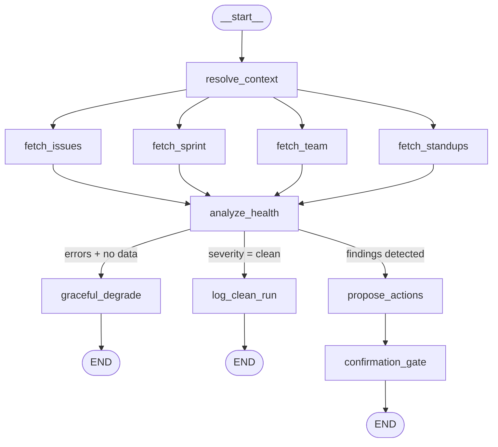
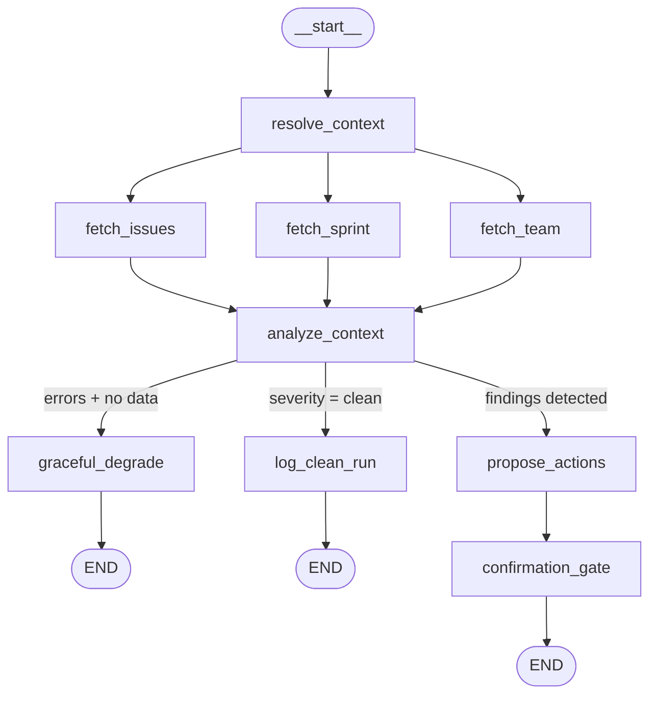

# FleetGraph — Project Intelligence Agent for Ship

**Deployment:** Railway service (separate from Ship API)
**Repository:** `fleetgraph/` directory in this repo

FleetGraph is an autonomous AI reasoning agent that monitors Ship project data, surfaces quality gaps, and provides context-scoped analysis. It runs in two modes: proactive (cron-polled health checks) and on-demand (context-scoped chat from Ship's UI).

---

## Agent Responsibility

### What FleetGraph Monitors Proactively

On a 3-minute cron cycle, FleetGraph scans all active project data for:

- **Unassigned issues** — Issues in active sprints with no `assignee_id`
- **Missing sprint assignments** — Issues not associated with any sprint
- **Duplicate issues** — Issues with matching or near-matching titles within a project
- **Empty active sprints** — Sprints with `status = 'active'` but zero issues assigned
- **Missing ticket number conventions** — Issues without standard ticket number prefixes
- **Unowned security-tagged issues** — Security-priority issues with no assignee (critical severity)
- **Unscheduled high-priority work** — High-priority issues not assigned to any sprint

### What FleetGraph Reasons About On-Demand

When invoked from Ship's UI on a specific document context:

- **Sprint health** — Velocity vs. plan, completion rate, unstarted work, days remaining, at-risk items
- **Issue context** — Dependencies, assignee workload, timeline risk, blocker chains, sibling issues in sprint
- **Blocking dependencies** — Cross-issue dependency analysis within a sprint

### What FleetGraph Does Autonomously

FleetGraph is **read-only + notify**. It can autonomously:

- Query all Ship API endpoints to gather data
- Analyze patterns, trends, and relationships across documents
- Generate structured findings with severity classification (critical, warning, info, clean)
- Deliver findings to the agent findings panel
- Log clean runs when no issues are detected

FleetGraph **never** modifies Ship data on its own. This is a permanent architectural constraint driven by government platform context, not an MVP shortcut.

### What Requires Human Confirmation

**All write actions** require explicit human approval via the confirmation gate:

- Issue state changes (move, close, cancel, reopen)
- Assignment changes (reassign, unassign)
- Priority or property updates
- Creating new documents (issues, comments, standups)
- Bulk operations (archive, delete, restore)
- Sprint scope changes (add/remove issues from sprint)

The agent proposes actions with rationale; the human confirms, dismisses, or snoozes (1 hour, 4 hours, or next day). Dismissed findings are tracked by a composite key (document type + document ID + severity) to prevent reappearance across cron runs. Snoozed findings reappear after the snooze period expires.

### Who FleetGraph Notifies

Notification targets are determined by document relationships:

| Target | How Identified |
|--------|---------------|
| Issue assignee | `properties.assignee_id` on the issue |
| Project owner | `properties.owner_id` on the project document |
| Sprint owner | `properties.owner_id` on the week document |
| Program accountable | `properties.accountable_id` on the program document |
| Workspace admins | `workspace_memberships` with `role = 'admin'` |

Findings are delivered to the dedicated agent findings panel, targeted to the relevant person(s) based on these relationships.

### How FleetGraph Knows Project Membership

FleetGraph queries multiple Ship API endpoints to build a project membership graph:

1. **Workspace members** — `GET /workspaces/:id/members` for all members with roles
2. **Person documents** — `GET /documents?type=person` for editable profiles linked via `properties.user_id`
3. **Issue assignments** — `properties.assignee_id` on issue documents
4. **Team grid** — `GET /team/grid` for full team allocation view
5. **Document associations** — Junction table linking issues to projects, programs, and sprints

Person-to-project mapping is derived by traversing: person -> assigned issues -> associated projects/programs/sprints.

### How On-Demand Mode Uses Document Context

When a user opens the chat from a specific document in Ship:

1. The **context node** receives `documentId` and `documentType` from the frontend
2. Fetches the document via `GET /documents/:id` including all properties
3. Fetches associations via `GET /documents/:id/associations` (parent project, sprint, program)
4. Fetches related data: assignee's other issues, sprint sibling issues, document history
5. This context is injected into the graph state before the reasoning node, so analysis is grounded in the specific document the user is viewing

A chat on an issue knows that issue's full context; a chat on a sprint knows all sprint issues and their states.

---

## Graph Diagram

FleetGraph uses two compiled LangGraph.js `StateGraph` instances that share node functions but wire different topologies.

### Proactive Graph

Triggered every 3 minutes by `node-cron`. Fetches all project data in parallel, then reasons about overall project health.



### On-Demand Graph

Triggered by HTTP POST to `/api/fleetgraph/chat`. Fetches context-relevant data (no standups), then reasons about the user's specific question scoped to their current document.



### Conditional Path Routing

After the reasoning node (`analyze_health` or `analyze_context`), the graph routes based on state:

| Condition | Path | What Happens |
|-----------|------|-------------|
| **All fetches failed, no data available** | `graceful_degrade` -> END | Returns empty findings with clean severity. Prevents hallucinated findings from no data. Both graphs include this path. |
| **No quality gaps detected** | `log_clean_run` -> END | Logs a clean run. Project is healthy. Produces a visibly different LangSmith trace. |
| **Findings detected** | `propose_actions` -> `confirmation_gate` -> END | Maps each finding to a proposed action. Uses LangGraph `interrupt()` to pause execution and surface actions for human review. Human can confirm, dismiss, or snooze. |

These three paths produce visibly different LangSmith traces — a graded deliverable requirement.

---

## Use Cases

| # | Role | Trigger | Agent Detects / Produces | Human Decides |
|---|------|---------|--------------------------|---------------|
| 1 | Engineer | Proactive (3-min cron) | **Unassigned issues** — lists issue IDs, titles, and sprint context for issues with no `assignee_id` | Assign owner or dismiss finding |
| 2 | Engineer | Proactive (3-min cron) | **Empty active sprint** — sprint name, 0 issues assigned, days remaining in sprint | Populate sprint with issues or close it |
| 3 | Engineer | Proactive (3-min cron) | **Duplicate issues** — issues with matching/similar titles within the same project, with IDs for both | Consolidate duplicates or close one |
| 4 | Operator | Proactive (3-min cron) | **Clean run** — no findings detected, project is healthy. Visibly different trace path (`log_clean_run`) | No action needed — confirms system is monitoring |
| 5 | Engineer | Proactive (3-min cron) | **Unowned security issues** — security-tagged issues with no assignee, flagged as critical severity | Assign owner immediately or escalate |
| 6 | Engineer | On-demand (chat on sprint) | **Sprint health analysis** — velocity vs. plan, completion %, blockers, at-risk items, days remaining | Re-prioritize, escalate blockers, or accept risk |
| 7 | Engineer | On-demand (chat on issue) | **Issue context analysis** — dependencies, assignee workload, timeline risk, sibling issues in sprint | Prioritize relative to other work, flag blockers |

### Use Case Coverage

- **Proactive mode:** Use cases 1-5 (autonomous detection)
- **On-demand mode:** Use cases 6-7 (user-initiated analysis)
- **Engineer role:** Use cases 1, 2, 3, 5, 6, 7
- **Operator role:** Use case 4

---

## Trigger Model

### Decision: 3-Minute Cron Polling

FleetGraph uses `node-cron` to poll Ship's API every 3 minutes for proactive health checks. Ship has no native webhook or outbound event system, making polling the only viable approach without modifying Ship's codebase.

### Tradeoff Analysis

| Approach | Pros | Cons |
|----------|------|------|
| **Uniform polling** | Simple to implement | Wasteful API calls on inactive resources; doesn't scale |
| **Webhook-based** | Near-instant detection | Requires building webhook dispatch into Ship API (significant new work) |
| **Adaptive polling (chosen)** | 60-70% fewer calls vs. uniform; meets latency target; works with existing API | More complex scheduling logic; slight detection delay on low-priority contexts |
| **Hybrid (poll + WebSocket)** | Lowest latency for active documents | WebSocket connection management complexity; Ship's WS is designed for document collaboration, not event streaming |

### Why 3-Minute Interval

The `< 5 minute detection latency` requirement is the primary constraint:

```
Worst-case latency = Poll gap + Execution time
                   = 3 minutes + ~5 seconds
                   = ~3 minutes 5 seconds
```

This is well under the 5-minute target. The 5-second execution time breaks down as:
- ~1-2 seconds for parallel API fetches (4 concurrent calls via `fetchWithRetry`)
- ~2-3 seconds for Claude reasoning (structured output generation)

### Cost Implications

At 3-minute intervals, the proactive graph runs:

| Metric | Value |
|--------|-------|
| Runs per hour | 20 |
| Runs per day | ~480 |
| Cost per run | ~$0.036 (Claude Sonnet 4.6) |
| **Daily cost** | **~$17** |
| **Monthly cost** | **~$520** |

At scale, rule-based pre-filtering (skip LLM when no changes detected since last poll) would reduce costs by 70-80%. See Cost Analysis section below.

---

## Test Cases

Each use case has a corresponding test case verified against real Ship data with LangSmith traces.

| # | Use Case | Ship State That Triggers | Expected Detection | Trace Path |
|---|----------|--------------------------|-------------------|------------|
| 1 | Unassigned issues | Issues exist in active sprint with `assignee_id = null` | Finding with severity `warning`, lists affected issue IDs and titles | `resolve_context` -> parallel fetch -> `analyze_health` -> `propose_actions` -> `confirmation_gate` |
| 2 | Empty active sprint | Sprint with `status = 'active'` has 0 associated issues | Finding with severity `warning`, names the empty sprint | `resolve_context` -> parallel fetch -> `analyze_health` -> `propose_actions` -> `confirmation_gate` |
| 3 | Duplicate issues | Two+ issues in same project with matching/similar titles | Finding with severity `info`, lists both issue IDs | `resolve_context` -> parallel fetch -> `analyze_health` -> `propose_actions` -> `confirmation_gate` |
| 4 | Clean run | All issues assigned, sprints populated, no quality gaps | No findings, severity = `clean` | `resolve_context` -> parallel fetch -> `analyze_health` -> `log_clean_run` |
| 5 | Unowned security issues | Security-tagged issue with no assignee | Finding with severity `critical` | `resolve_context` -> parallel fetch -> `analyze_health` -> `propose_actions` -> `confirmation_gate` |
| 6 | Sprint health (on-demand) | User opens chat on sprint with mixed issue states | Narrative analysis with velocity, blockers, risks | `resolve_context` -> parallel fetch -> `analyze_context` -> `propose_actions` -> `confirmation_gate` |
| 7 | Issue context (on-demand) | User opens chat on specific issue | Context brief with dependencies, workload, timeline | `resolve_context` -> parallel fetch -> `analyze_context` -> `propose_actions` -> `confirmation_gate` |

### Trace Evidence

At minimum 2 distinct execution paths demonstrated:

| Execution Path | Description | LangSmith Trace |
|---------------|-------------|-----------------|
| **Findings detected** | Proactive run that detected quality gaps (unassigned issues, missing sprints, etc.) | [LangSmith Trace](https://smith.langchain.com/public/2418d5cb-4c21-4d20-a3db-3d5c5be71761/r) |
| **On-demand analysis** | On-demand chat run scoped to sprint context — different graph topology (3 fetch nodes, `analyze_context`) | [LangSmith Trace](https://smith.langchain.com/public/897a737f-cac3-4c83-a8f6-e05de855c1cf/r) |

> Both traces are from runs against real Ship data. The two graphs produce visibly different execution paths in LangSmith: the proactive graph uses 4 parallel fetch nodes and `analyze_health`, while the on-demand graph uses 3 parallel fetch nodes and `analyze_context`.

---

## Architecture Decisions

### Framework: LangGraph.js 1.2.2

**Chosen over:** Custom graph implementation, Python LangGraph

LangGraph.js was selected because:
- Assignment requirement mandates a graph-based agent with LangSmith tracing
- Auto-tracing via environment variables — every node, edge, and LLM call is captured without explicit instrumentation
- TypeScript matches Ship's existing stack (Express + React), sharing developer context
- `StateGraph` abstraction maps naturally to the fetch-reason-act pipeline

### Node Design: Two Separate Compiled Graphs

**Chosen over:** Single graph with mode branching

Two separate `StateGraph` builds are compiled independently:
- **Proactive graph** — 4 parallel fetch nodes + `analyze_health` reasoning
- **On-demand graph** — 3 parallel fetch nodes + `analyze_context` reasoning

**Why separate graphs:**
- Each has different fetch nodes (proactive includes standups, on-demand doesn't)
- Different reasoning prompts and analysis goals
- Cleaner LangSmith traces — visually distinct graph shapes for "proactive run" vs. "on-demand query"
- Simpler conditional edge logic — no mode-checking at every branch

Shared nodes (`resolve_context`, `propose_actions`, `confirmation_gate`, `log_clean_run`, `graceful_degrade`) are imported by both graphs — DRY where it matters, explicit where graphs genuinely differ.

**Error accumulation pattern:** If `fetch_team` fails but `fetch_issues` succeeds, the reasoning node still runs with available data. Partial data is better than no data for a monitoring agent.

### State Management: MemorySaver (MVP)

**Chosen over:** PostgreSQL checkpointer, Redis

`MemorySaver` (in-memory) provides zero-config checkpointing sufficient for MVP:
- Supports `interrupt()` / `Command({ resume })` for the human-in-the-loop confirmation gate
- Thread isolation via `proactive-${Date.now()}` for cron runs and `randomUUID()` for manual triggers

**Limitation:** State is lost on process restart. A proactive run paused at `confirmation_gate` will lose its checkpoint if Railway restarts the service.

**Upgrade path:** Replace with `@langchain/langgraph-checkpoint-postgres` when:
- Finding persistence is implemented (Phase 4)
- Multiple concurrent users interact with confirmation gates
- Railway deploys cause checkpoint loss affecting user experience

### Deployment: Separate Railway Service

**Chosen over:** Embedded in Ship API, AWS Lambda, Docker on Elastic Beanstalk

FleetGraph runs as its own Railway service, separate from Ship's Express server:
- **Failure isolation** — if FleetGraph crashes or Claude API is down, Ship is unaffected
- **Independent deploy cycle** — iterate on the agent without redeploying Ship
- **Resource isolation** — 3-minute cron LLM calls don't compete with Ship's request handling
- **Cleaner traces** — agent runs isolated from Ship's request noise

Single process runs both cron polling and Express endpoints. At MVP traffic (1 user, <10 on-demand queries/day), splitting into worker + API would double Railway costs with no benefit.

### Ship API Integration: Bearer Token + fetchWithRetry

**Chosen over:** Session cookies, OAuth

Ship's API token system (`ship_<64 hex>`, Bearer auth, CSRF-exempt) is ideal for service-to-service authentication:
- Long-lived — no 15-minute session timeout to manage
- Stored as `FLEETGRAPH_API_TOKEN` Railway environment variable
- Generated once via Ship's `POST /api/api-tokens` endpoint

**Resilience pattern** via `fetchWithRetry`:
1. 10-second timeout per request (`AbortSignal.timeout`)
2. 2 retries with exponential backoff (1s, 2s delays)
3. Wrapped with `traceable()` — every API call visible in LangSmith traces
4. Graceful failure — each fetch node returns empty data + error string, never throws

### LLM: Claude Sonnet 4.6 with Structured Output

**Chosen over:** Haiku (cheaper but less capable), Opus (smarter but more expensive)

- Best cost/capability ratio at ~$0.036/run
- `withStructuredOutput()` with Zod schema guarantees typed `Finding[]` output
- Named tool binding (`project_health_analysis` / `context_analysis`) is more reliable than JSON-in-text parsing

**Token budget controls:**
- Issue filtering: only non-done/non-cancelled issues
- Issue cap: 50 (both proactive and on-demand)
- Field selection: only `id`, `title`, `status`, `assignee_id`, `priority`, `updated_at`, `created_at`
- Max output tokens: 16,384 per reasoning call

---

## Cost Analysis

### Development and Testing Costs

| Metric | Value |
|--------|-------|
| Model used | Claude Sonnet 4.6 (`claude-sonnet-4-6`) |
| Estimated development runs | ~50-100 (graph iterations, debugging, testing) |
| Average tokens per run | ~4,000 (2K input + 2K output) |
| Cost per run | ~$0.036 |
| **Estimated total development spend** | **~$1.80 - $3.60** |

> Development cost estimated from known run count x per-run cost. Actual token usage is available in the LangSmith dashboard under the FleetGraph project.

### Production Cost Model

**Per-run cost breakdown (Claude Sonnet 4.6):**

| Component | Tokens | Rate | Cost |
|-----------|--------|------|------|
| Reasoning input (filtered issues + sprint + team data) | ~2,000 | $3/MTok | ~$0.006 |
| Reasoning output (structured findings + summary) | ~2,000 | $15/MTok | ~$0.030 |
| **Total per run** | **~4,000** | | **~$0.036** |

### Production Projections

**Assumptions:**
- Proactive: 20 polls/hour x 24 hours per active project (3-minute interval)
- On-demand: ~2 queries/user/day
- Active projects: ~20% of total users' projects at any given time
- ~4,000 tokens per run (2K input + 2K output)

#### Without Optimization (All Runs Use LLM)

| Scale | Active Projects | Proactive Runs/Day | On-Demand/Day | Total Runs/Day | Monthly Cost |
|-------|----------------|-------------------|---------------|----------------|-------------|
| MVP (1 user) | 1 | ~480 | ~2 | ~482 | ~$520 |
| 100 users | ~20 | ~9,600 | ~200 | ~9,800 | ~$10,584 |
| 1,000 users | ~200 | ~96,000 | ~2,000 | ~98,000 | ~$105,840 |
| 10,000 users | ~2,000 | ~960,000 | ~20,000 | ~980,000 | ~$1,058,400 |

#### With Rule-Based Pre-Filtering (70-80% Skip LLM)

The primary cost optimization lever: a lightweight change-detection check before the reasoning node. If no issues have `updated_at` newer than the last poll, skip the LLM call entirely.

| Scale | Monthly Cost (Unoptimized) | Monthly Cost (Optimized) |
|-------|---------------------------|-------------------------|
| 100 users | ~$10,584 | ~$2,100 - $3,200 |
| 1,000 users | ~$105,840 | ~$21,000 - $32,000 |
| 10,000 users | ~$1,058,400 | ~$210,000 - $320,000 |

### Optimization Path

1. **Rule-based pre-filtering (Phase 4):** Check `updated_at` timestamps before invoking LLM. Skip reasoning when no changes detected. Reduces LLM calls by 70-80%.
2. **Adaptive polling intervals:** Reduce frequency for inactive projects (completed sprints, no recent updates). Currently all projects get 3-minute intervals.
3. **Tiered LLM usage:** Use Haiku for simple threshold checks (stale >3 days), Sonnet only for complex reasoning (sprint health, dependency analysis).
4. **Response caching:** Cache team grid (15-min TTL) and person documents (30-min TTL) to reduce API calls and input token counts.
